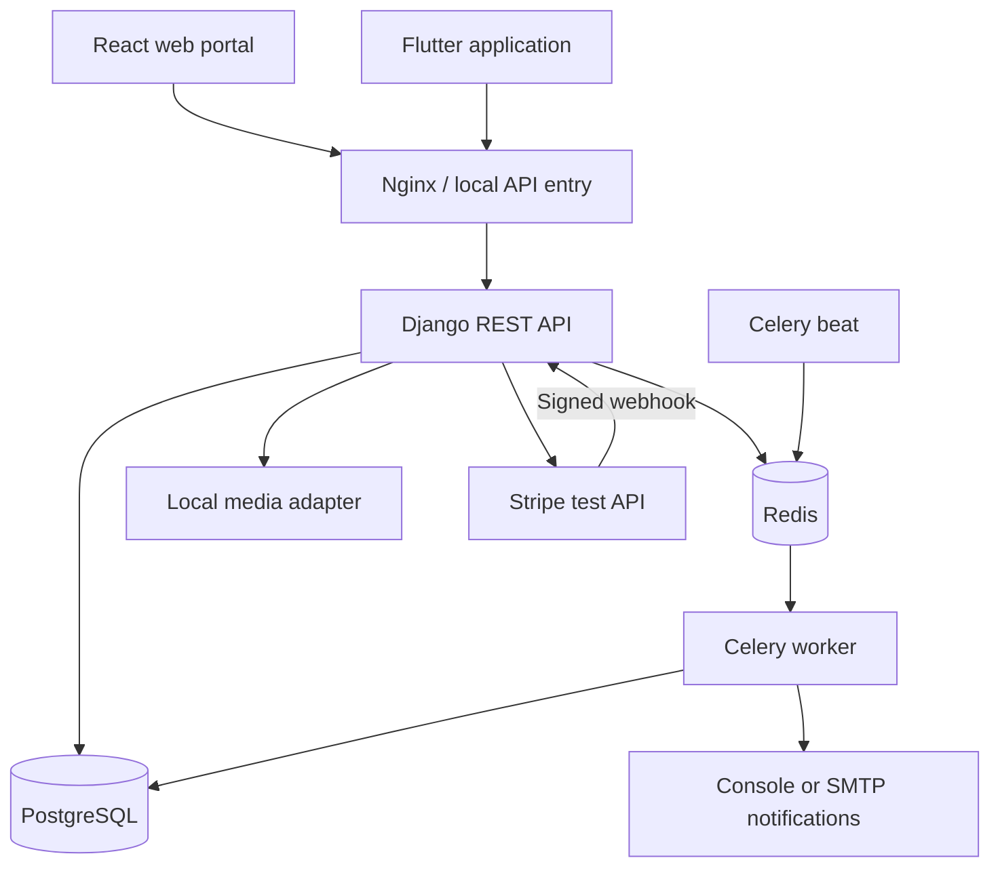
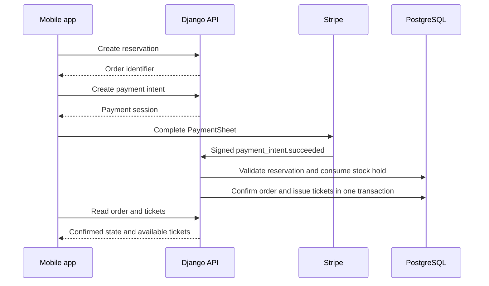

# FAN iD

Secure ticketing, event management and admission control.

Individual final project at Holberton School France, designed and developed by [Mohamed Ayoub Abbassi](#author).

This is the `main` branch: the reference branch for local development and validation. Deployment-specific configuration and operating instructions are documented in the [deploy branch](https://github.com/Abbassimedayoub/FAN-iD/tree/deploy).

## Contents

- [Project overview](#project-overview)
- [Architecture](#architecture)
- [Local system diagram](#local-system-diagram)
- [API reference](#api-reference)
- [Repository layout](#repository-layout)
- [Local setup](#local-setup)
- [Web development](#web-development)
- [Mobile development](#mobile-development)
- [Payment and ticket lifecycle](#payment-and-ticket-lifecycle)
- [Testing and quality](#testing-and-quality)
- [Security and configuration](#security-and-configuration)
- [Troubleshooting](#troubleshooting)
- [Screenshots](#screenshots)
- [Documentation](#documentation)
- [Project maintenance](#project-maintenance)
- [Author](#author)
- [License](#license)

## Project overview

FAN iD is a ticketing and event access-control platform developed as an individual final project at Holberton School France.

The project connects event administration, ticket purchasing, payment confirmation, and entrance validation in one application. A React web portal supports administrative and organizer workflows. A Flutter application provides the fan experience and scanner workflows. Both clients use the same Django REST API.

### User roles

| Role | Responsibilities |
| --- | --- |
| Fan | Browse events, reserve tickets, pay, view tickets and dynamic QR codes, and manage account security. |
| Organizer | Manage events, ticket categories and scanner assignments; monitor admissions and manage event lifecycle actions. |
| Scanner | Access assigned events and validate tickets at the entrance. |
| Administrator | Manage organizer accounts, oversee platform activity and access administrative reporting. |

### Main capabilities

- Email-based authentication, session management, device binding and account recovery.
- Event catalog, event images, ticket categories, pricing and capacity management.
- Time-limited reservations and payment preparation.
- Stripe PaymentSheet integration in the mobile application.
- Payment confirmation through signed Stripe webhooks.
- Ticket issuance, transfer and dynamic QR codes.
- Admission validation, duplicate-entry protection and event dashboards.
- Event cancellation and refund processing.
- Background processing, notifications and operational health checks.

## Architecture

The backend is a modular monolith. Business domains share a deployment and database while keeping explicit application boundaries. External services are accessed through adapters.

| Component | Technology | Responsibility |
| --- | --- | --- |
| Web portal | React 19, TypeScript, Vite, TanStack Query | Administration and organizer interfaces |
| Mobile application | Flutter, Riverpod, Dio, flutter_stripe | Fan and scanner interfaces |
| API | Python 3.12, Django, Django REST Framework, Uvicorn | Authentication, authorization and business operations |
| Database | PostgreSQL 15 | Transactional application data |
| Cache and messaging | Redis-compatible service | Cache, locks, channel layer and Celery transport |
| Background processing | Celery worker and Celery beat | Queued work and recurring tasks |
| Payments | Stripe | Payment processing and refunds |
| Object storage | Local adapter or Cloudflare R2 | Event media |
| Notifications | Console adapter or SMTP | Transactional messages |

### Domain organization

| Backend module | Responsibility |
| --- | --- |
| `identity` | Users, roles, authentication, sessions and device security |
| `organizing` | Organizer lifecycle and scanner management |
| `catalog` | Events, categories, images and event lifecycle |
| `ordering` | Reservations, orders and stock holds |
| `payments` | Payment intents, webhook processing and refunds |
| `ticketing` | Tickets, transfers and dynamic QR codes |
| `access` | Admission sessions, scans, dashboards and final reports |
| `notifying` | Notification delivery |
| `core` | Shared infrastructure, idempotency, outbox, concurrency and health |
| `realtime` | Realtime integration boundary |

Django Channels and the channel layer are configured, but the ASGI WebSocket URL list is currently empty. Their presence should not be interpreted as a complete live WebSocket feature.

### Consistency and security

PostgreSQL transactions protect business state. The transactional outbox supports reliable follow-up processing, and idempotency protects selected operations against duplicate requests. Versioned resources use `ETag` and `If-Match` to prevent stale writes.

The server remains responsible for authorization, ticket validity and order confirmation. A successful client-side payment screen does not replace backend payment confirmation.

## API reference

Business endpoints use the `/api/v1` prefix and generally do not have a trailing slash. Schema and Swagger routes are exceptions.

| Method | Endpoint | Purpose |
| --- | --- | --- |
| GET | `/api/v1/health` | Database and Redis health |
| GET | `/api/v1/health/ready` | Detailed dependency readiness |
| POST | `/api/v1/auth/register` | Register a fan account |
| POST | `/api/v1/auth/login` | Authenticate |
| POST | `/api/v1/auth/token/refresh` | Refresh a session |
| GET / PATCH | `/api/v1/auth/me` | Read or update the authenticated profile |
| GET | `/api/v1/catalog/events` | Browse the fan catalog |
| GET / POST | `/api/v1/events` | List or create managed events |
| PUT | `/api/v1/events/{event_id}/image` | Save an event image |
| POST | `/api/v1/events/{event_id}/cancel` | Cancel an event |
| POST | `/api/v1/orders/reservations` | Create a reservation |
| GET | `/api/v1/orders/{order_id}` | Read order status |
| POST | `/api/v1/orders/{order_id}/payment-intent` | Prepare payment |
| POST | `/api/v1/payments/stripe/webhook` | Receive signed Stripe events |
| GET | `/api/v1/tickets` | List the current user's tickets |
| GET | `/api/v1/tickets/{ticket_id}/qr` | Retrieve a dynamic ticket QR payload |
| POST | `/api/v1/access/scans` | Validate an admission scan |
| GET | `/api/v1/access/events/{event_id}/live-dashboard` | Read event admission activity |

Permissions, request bodies and preconditions vary by endpoint. Consult the generated OpenAPI schema and the corresponding serializers and views for the complete contract.

### Request conventions

- Authenticate protected endpoints with the application's supported session or bearer-token flow.
- Return the current resource version through `If-Match` for versioned writes.
- Supply `Idempotency-Key` where required by the operation.
- Use `X-Correlation-ID` to connect a client request to backend logs.
- Preserve the backend error code when diagnosing an issue; display an appropriate message in the interface.
- Never publish access tokens, refresh tokens, payment client secrets or private signed media URLs.

## Repository layout

| Path | Contents |
| --- | --- |
| `backend/` | Django application, domain modules, migrations and tests |
| `web/` | React application and web tests |
| `mobile/` | Flutter application, Android configuration and mobile tests |
| `infra/` | Local infrastructure, Nginx and telemetry configuration |
| `scripts/` | Quality checks and repository tooling |
| `docs/adr/` | Architecture decisions |
| `docs/api/` | API documentation |
| `docs/runbooks/` | Operational documentation |
| `.github/workflows/` | CI and deployment workflow definitions |


## Local system diagram



The diagram shows the main application paths, not every connection. API and worker processes share the configured adapters. Docker Compose also includes a separate ASGI service and an OpenTelemetry collector.

## Local setup

### Prerequisites

| Tool | Project reference |
| --- | --- |
| Git | Clone and branch management |
| Docker and Docker Compose v2 | Local backend and supporting services |
| Python 3.12 | Backend runtime and repository scripts |
| Node.js | Use a version compatible with the locked Vite dependencies; the web workflow currently selects Node 20 |
| Flutter | The mobile workflow selects Flutter 3.44.7 |
| Android SDK and Java | Required for Android builds; check `flutter doctor -v` |

Dependency manifests and lockfiles are the source of truth. Run `npm ci` for the web application and retain the mobile lockfile for reproducible dependency resolution.

### 1. Clone the development branch

```bash
git clone --branch main https://github.com/Abbassimedayoub/FAN-iD.git
cd FAN-iD
cp .env.example .env
```

If a local `.env` already exists, keep it and review the example rather than overwriting it.

### 2. Configure the environment

Edit the root `.env` before starting the stack.

| Variable | Local configuration |
| --- | --- |
| `DJANGO_SETTINGS_MODULE` | `config.settings.dev` |
| `DJANGO_SECRET_KEY` | A local-only secret |
| `JWT_SIGNING_KEY` | A separate, non-empty signing secret |
| `QR_SIGNING_KEY` | A separate signing secret for ticket QR codes |
| `DATABASE_URL` | PostgreSQL connection using the Compose service name |
| `REDIS_URL` | Redis URL including an explicit database path |
| `CELERY_BROKER_URL` | Redis broker URL |
| `CELERY_RESULT_BACKEND` | Redis result-backend URL |
| `PAYMENT_GATEWAY` | `fake` for local adapter tests; `stripe` for Stripe integration testing |
| `OBJECT_STORAGE_BACKEND` | `local` |
| `NOTIFICATION_BACKEND` | `console` for development |
| `CORS_ALLOWED_ORIGINS` | The local web origin |

Generate independent values for signing secrets:

```bash
python3 -c 'import secrets; print(secrets.token_urlsafe(48))'
```

Repeat for each key and store the values only in the local environment. Do not reuse production secrets.

Keep the explicit Redis database suffixes in the local example, such as `redis://redis:6379/0`. The deployment branch contains additional URL handling for managed Redis connection strings.

### 3. Start the services

```bash
docker compose up --build -d
docker compose ps
docker compose logs --tail=100 api worker beat
```

The development API entrypoint applies migrations on startup. The role seed migration is part of the database setup.

### 4. Verify the backend

```bash
curl --fail-with-body http://localhost:8000/api/v1/health
curl --fail-with-body http://localhost:8000/api/v1/health/ready
```

| Resource | Local address |
| --- | --- |
| API | `http://localhost:8000` |
| Nginx entry | `http://localhost:8080` |
| Health | `http://localhost:8000/api/v1/health` |
| Readiness | `http://localhost:8000/api/v1/health/ready` |
| OpenAPI schema | `http://localhost:8000/api/v1/schema/` |
| Swagger UI | `http://localhost:8000/swagger-ui/` |
| Django admin | `http://localhost:8000/admin/` |
| Metrics | `http://localhost:8000/metrics` |

Check dependency statuses in the readiness body, not just the HTTP status.

### 5. Create the administrator

```bash
docker compose exec api python manage.py createsuperuser
```

Follow the prompts for email, date of birth and password. This creates an account in the local database only. No shared administrator credentials are distributed.

## Web development

From the repository root:

```bash
cd web
cp .env.example .env
npm ci
npm run dev
```

Set `VITE_API_URL=http://localhost:8080` in `web/.env`, or use the API's direct local address. The backend must allow the web application's origin.

Vite variables are client-visible build configuration, not a place for secrets.

## Mobile development

From the repository root:

```bash
cd mobile
flutter pub get
flutter doctor -v
flutter devices
flutter run --dart-define=FANID_API_URL=http://10.0.2.2:8000
```

The example address is for an Android emulator. A physical phone needs an API address reachable from that device; `localhost` refers to the phone itself. The default Compose ports are bound to the development machine's loopback interface.

### Stripe integration testing

The default fake payment adapter does not provide a real Stripe PaymentSheet session. To test the complete payment journey:

1. Configure the backend with `PAYMENT_GATEWAY=stripe` and sandbox credentials.
2. Arrange signed webhook delivery to the backend.
3. Build or run the mobile application with `STRIPE_PUBLISHABLE_KEY` from the same Stripe sandbox.
4. Use a newly created reservation and complete payment before its expiry.
5. Check the order state and issued ticket after webhook processing.

The mobile application reads `FANID_API_URL` and `STRIPE_PUBLISHABLE_KEY` through compile-time Dart defines. It does not automatically read the repository's `.env`.

## Payment and ticket lifecycle



The cart is cleared after the mobile application observes the paid order state. Ticket issuance and order confirmation share a database transaction; a ticket issuance failure rolls back confirmation.

Event cancellation has a separate refund lifecycle. When refunds are requested, the outbox schedules background refund processing. A successful cancellation response alone does not establish that Stripe has completed every refund.

## Testing and quality

### Backend

From the repository root, with the Compose dependencies running:

```bash
docker compose exec -T api python -m pytest
docker compose exec -T api python manage.py check
```

Tests use the configured test database. Never run the development test suite against the hosted database.

### Web

```bash
cd web
npm run lint
npm run format:check
npm run typecheck
npm run test -- --run --coverage
npm run build
```

### Mobile

```bash
cd mobile
dart format --output=none --set-exit-if-changed .
flutter analyze
flutter test --coverage
```

### Coverage

From the repository root, after generating the relevant reports:

```bash
python3 scripts/coverage_gate.py check --stack mobile
python3 scripts/coverage_gate.py check --stack web
```

Coverage baselines are versioned. Do not lower a baseline to hide a regression. The workflows in `.github/workflows/` define the full automated checks and their triggers; this README does not claim a permanent test count or coverage percentage.

## Security and configuration

- Keep `.env`, provider credentials, signing keys and keystores out of Git.
- Use independent Django, JWT and QR signing secrets.
- Retain permission checks, request throttling and concurrency preconditions.
- Treat device binding and session revocation as server-side controls.
- Use Stripe sandbox credentials for development.
- Keep personally identifiable information out of screenshots and public logs.
- Use only disposable demonstration tickets when capturing QR screens.

## Troubleshooting

| Symptom | What to check |
| --- | --- |
| API does not start | Required environment values, database readiness and migration logs |
| Health works but registration fails | Django cache configuration and the complete Redis URL |
| Profile update returns 428 | Missing or unusable `If-Match`; inspect the latest profile ETag |
| Payment succeeds but no ticket appears | Webhook delivery, order state, reservation expiry and worker/outbox processing |
| Event photo cannot be saved | HTTP response, correlation ID, storage configuration and write permissions |
| Mobile cannot reach the API | Device routing, API address and Android network configuration |
| Android release build fails | Branch-specific Gradle setup and the first actual build error |

The `deploy` branch includes Android build and networking adjustments used for the hosted demonstration. Use that branch for the documented deployment APK procedure rather than assuming both branches are interchangeable.

## Screenshots

### Web administration and event management

Screenshots will be added after the final presentation capture session.

<!-- Add after uploading:  -->
<!-- Add after uploading:  -->
<!-- Add after uploading:  -->

### Mobile ticketing and scanning

Screenshots will be added after the final presentation capture session.

<!-- Add after uploading:  -->
<!-- Add after uploading:  -->
<!-- Add after uploading:  -->
<!-- Add after uploading:  -->
<!-- Add after uploading:  -->


## Documentation

- [Architecture decisions](docs/adr/)
- [API documentation](docs/api/)
- [Security notes](docs/SECURITY.md)
- [Privacy and data handling](docs/GDPR.md)
- [Observability](docs/OBSERVABILITY.md)
- [Operational runbooks](docs/runbooks/)
- [Hosted deployment guide](https://github.com/Abbassimedayoub/FAN-iD/blob/deploy/README.md)

## Project maintenance

This is an individually developed school project, maintained by its author. The `main` branch is used for local development and validation; `deploy` contains the hosted environment configuration.

Changes promoted between branches must preserve environment-specific settings and the branch-specific README. Review diffs and run the relevant checks before publishing. Do not include local credentials, APK build directories or unrelated work in documentation commits.

## Author

Designed and developed by Mohamed Ayoub Abbassi as an individual final project at Holberton School France.

Mohamed Ayoub Abbassi is the sole project author and contributor.

- [LinkedIn](https://www.linkedin.com/in/mohamed-ayoub-abbassi/)
- [GitHub](https://github.com/Abbassimedayoub)
- [Email](mailto:abbassimohamedayoub@gmail.com)

## License

No license file is currently included in this branch. Contact the author for permission before reusing or redistributing the project. Third-party dependencies remain subject to their own licenses.
