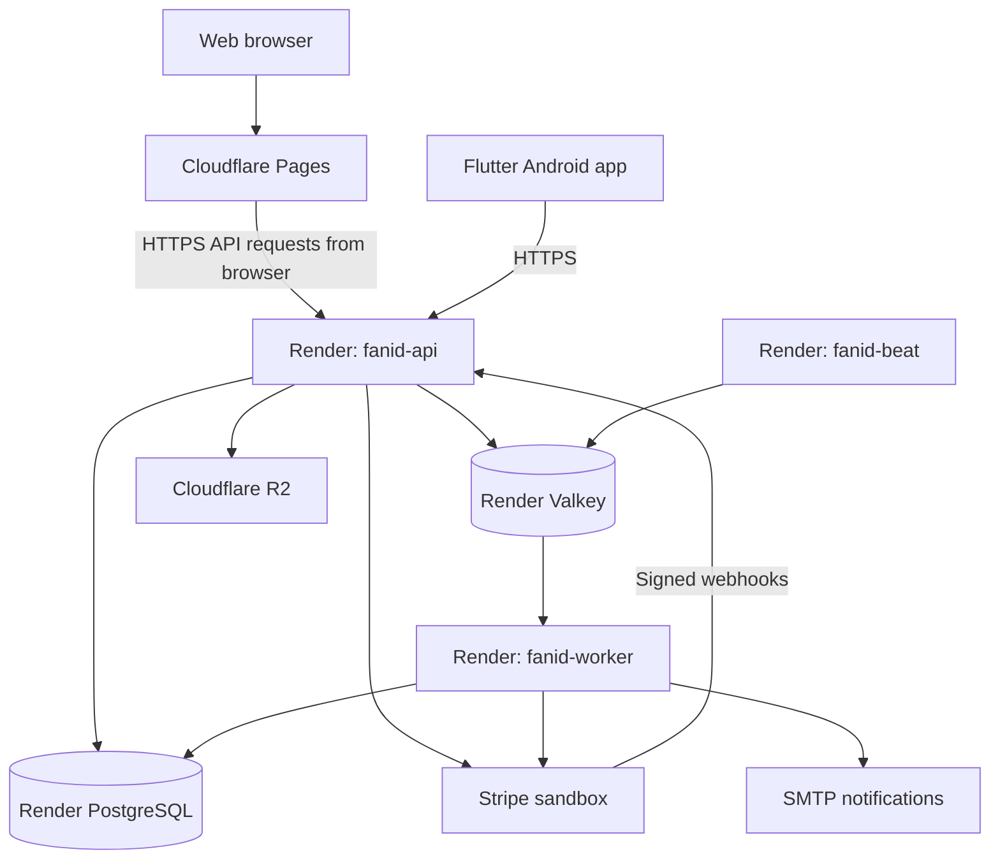
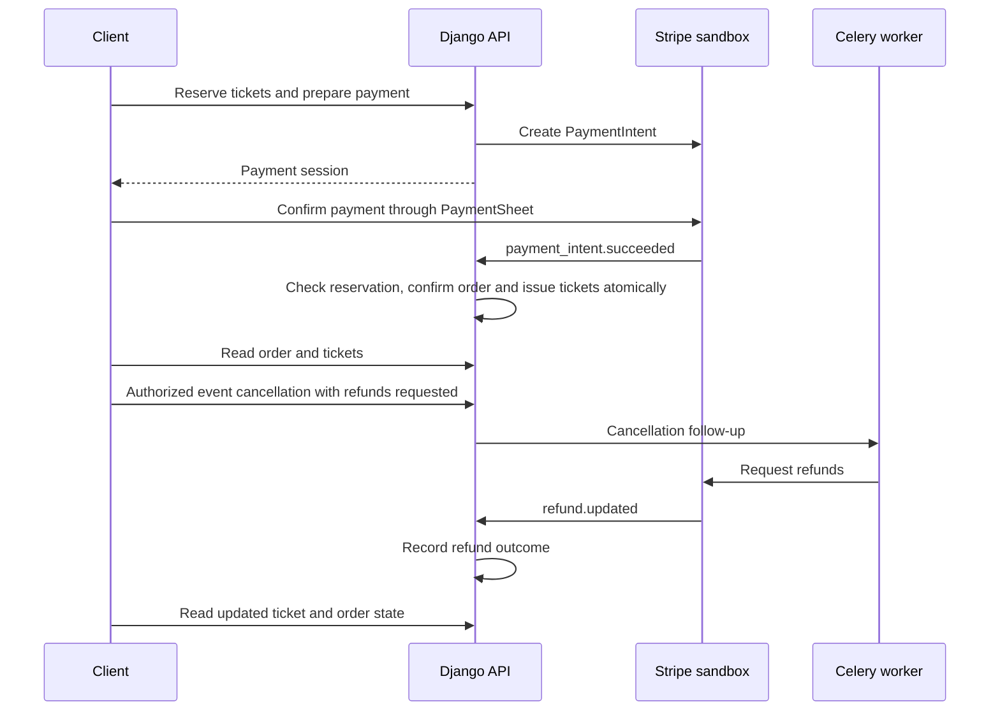

# FAN iD

Hosted ticketing and event access-control platform.

Individual final project at Holberton School France, designed and developed by [Mohamed Ayoub Abbassi](#author).

This is the `deploy` branch. It documents the hosted environment, service configuration, Android demonstration build and operating procedures. For local development, use the [main branch](https://github.com/Abbassimedayoub/FAN-iD/tree/main).

The application is publicly hosted, but payments currently use Stripe test mode. This is an educational demonstration, not a live-money ticketing service.

## Contents

- [Hosted application](#hosted-application)
- [Project overview](#project-overview)
- [Architecture](#architecture)
- [Deployment diagram](#deployment-diagram)
- [API reference](#api-reference)
- [Repository layout](#repository-layout)
- [Render deployment](#render-deployment)
- [Web deployment](#web-deployment)
- [Storage and notifications](#storage-and-notifications)
- [Stripe configuration](#stripe-configuration)
- [Payment and refund processing](#payment-and-refund-processing)
- [Android demonstration build](#android-demonstration-build)
- [Verification and operations](#verification-and-operations)
- [Security and deployment boundaries](#security-and-deployment-boundaries)
- [Troubleshooting](#troubleshooting)
- [Screenshots](#screenshots)
- [Documentation](#documentation)
- [Author](#author)
- [License](#license)

## Hosted application

| Resource | Address |
| --- | --- |
| Web portal | [fan-id.pages.dev](https://fan-id.pages.dev) |
| API health | [Health](https://fanid-api-9sep.onrender.com/api/v1/health) |
| API readiness | [Readiness](https://fanid-api-9sep.onrender.com/api/v1/health/ready) |
| API base URL | `https://fanid-api-9sep.onrender.com` |

Public API documentation is disabled in the hosted configuration. Generate or inspect the schema in the local environment.

## Project overview

FAN iD is a ticketing and event access-control platform developed as an individual final project at Holberton School France.

The project connects event administration, ticket purchasing, payment confirmation, and entrance validation in one application. A React web portal supports administrative and organizer workflows. A Flutter application provides the fan experience and scanner workflows. Both clients use the same Django REST API.

### User roles

| Role | Responsibilities |
| --- | --- |
| Fan | Browse events, reserve tickets, pay, view tickets and dynamic QR codes, and manage account security. |
| Organizer | Manage events, ticket categories and scanner assignments; monitor admissions and manage event lifecycle actions. |
| Scanner | Access assigned events and validate tickets at the entrance. |
| Administrator | Manage organizer accounts, oversee platform activity and access administrative reporting. |

### Main capabilities

- Email-based authentication, session management, device binding and account recovery.
- Event catalog, event images, ticket categories, pricing and capacity management.
- Time-limited reservations and payment preparation.
- Stripe PaymentSheet integration in the mobile application.
- Payment confirmation through signed Stripe webhooks.
- Ticket issuance, transfer and dynamic QR codes.
- Admission validation, duplicate-entry protection and event dashboards.
- Event cancellation and refund processing.
- Background processing, notifications and operational health checks.

## Architecture

The backend is a modular monolith. Business domains share a deployment and database while keeping explicit application boundaries. External services are accessed through adapters.

| Component | Technology | Responsibility |
| --- | --- | --- |
| Web portal | React 19, TypeScript, Vite, TanStack Query | Administration and organizer interfaces |
| Mobile application | Flutter, Riverpod, Dio, flutter_stripe | Fan and scanner interfaces |
| API | Python 3.12, Django, Django REST Framework, Uvicorn | Authentication, authorization and business operations |
| Database | PostgreSQL 15 | Transactional application data |
| Cache and messaging | Redis-compatible service | Cache, locks, channel layer and Celery transport |
| Background processing | Celery worker and Celery beat | Queued work and recurring tasks |
| Payments | Stripe | Payment processing and refunds |
| Object storage | Local adapter or Cloudflare R2 | Event media |
| Notifications | Console adapter or SMTP | Transactional messages |

### Domain organization

| Backend module | Responsibility |
| --- | --- |
| `identity` | Users, roles, authentication, sessions and device security |
| `organizing` | Organizer lifecycle and scanner management |
| `catalog` | Events, categories, images and event lifecycle |
| `ordering` | Reservations, orders and stock holds |
| `payments` | Payment intents, webhook processing and refunds |
| `ticketing` | Tickets, transfers and dynamic QR codes |
| `access` | Admission sessions, scans, dashboards and final reports |
| `notifying` | Notification delivery |
| `core` | Shared infrastructure, idempotency, outbox, concurrency and health |
| `realtime` | Realtime integration boundary |

Django Channels and the channel layer are configured, but the ASGI WebSocket URL list is currently empty. Their presence should not be interpreted as a complete live WebSocket feature.

### Consistency and security

PostgreSQL transactions protect business state. The transactional outbox supports reliable follow-up processing, and idempotency protects selected operations against duplicate requests. Versioned resources use `ETag` and `If-Match` to prevent stale writes.

The server remains responsible for authorization, ticket validity and order confirmation. A successful client-side payment screen does not replace backend payment confirmation.

## API reference

Business endpoints use the `/api/v1` prefix and generally do not have a trailing slash. Schema and Swagger routes are exceptions.

| Method | Endpoint | Purpose |
| --- | --- | --- |
| GET | `/api/v1/health` | Database and Redis health |
| GET | `/api/v1/health/ready` | Detailed dependency readiness |
| POST | `/api/v1/auth/register` | Register a fan account |
| POST | `/api/v1/auth/login` | Authenticate |
| POST | `/api/v1/auth/token/refresh` | Refresh a session |
| GET / PATCH | `/api/v1/auth/me` | Read or update the authenticated profile |
| GET | `/api/v1/catalog/events` | Browse the fan catalog |
| GET / POST | `/api/v1/events` | List or create managed events |
| PUT | `/api/v1/events/{event_id}/image` | Save an event image |
| POST | `/api/v1/events/{event_id}/cancel` | Cancel an event |
| POST | `/api/v1/orders/reservations` | Create a reservation |
| GET | `/api/v1/orders/{order_id}` | Read order status |
| POST | `/api/v1/orders/{order_id}/payment-intent` | Prepare payment |
| POST | `/api/v1/payments/stripe/webhook` | Receive signed Stripe events |
| GET | `/api/v1/tickets` | List the current user's tickets |
| GET | `/api/v1/tickets/{ticket_id}/qr` | Retrieve a dynamic ticket QR payload |
| POST | `/api/v1/access/scans` | Validate an admission scan |
| GET | `/api/v1/access/events/{event_id}/live-dashboard` | Read event admission activity |

Permissions, request bodies and preconditions vary by endpoint. Consult the generated OpenAPI schema and the corresponding serializers and views for the complete contract.

### Request conventions

- Authenticate protected endpoints with the application's supported session or bearer-token flow.
- Return the current resource version through `If-Match` for versioned writes.
- Supply `Idempotency-Key` where required by the operation.
- Use `X-Correlation-ID` to connect a client request to backend logs.
- Preserve the backend error code when diagnosing an issue; display an appropriate message in the interface.
- Never publish access tokens, refresh tokens, payment client secrets or private signed media URLs.

## Repository layout

| Path | Contents |
| --- | --- |
| `backend/` | Django application, domain modules, migrations and tests |
| `web/` | React application and web tests |
| `mobile/` | Flutter application, Android configuration and mobile tests |
| `infra/` | Local infrastructure, Nginx and telemetry configuration |
| `scripts/` | Quality checks and repository tooling |
| `docs/adr/README.md` | Architecture overview |
| `docs/api/README.md` | API reference |
| `docs/diagrams/README.md` | System and workflow diagrams |
| `.github/workflows/` | CI and deployment workflow definitions |


## Deployment diagram



The API and background processes share the backend application and configured adapters. PostgreSQL and Valkey are managed data services; they do not receive application-code deployments.

## Render deployment

The [Render Blueprint](render.yaml) defines the following resources in Frankfurt:

| Resource | Type | Responsibility |
| --- | --- | --- |
| `fanid-api` | Docker web service | HTTP API and application entrypoint |
| `fanid-worker` | Docker background worker | Celery task execution |
| `fanid-beat` | Docker background worker | Recurring task scheduling |
| `fanid-postgres` | PostgreSQL 15 | Persistent business data |
| `fanid-redis` | Redis-compatible key-value service | Cache, locks and Celery transport |

### Deployment procedure

1. Select `deploy` as the source branch for the Blueprint and application services.
2. Review `render.yaml` and populate the environment values marked `sync: false`.
3. Apply the Blueprint configuration.
4. Check the required CI results and the exact commit selected for deployment.
5. Wait for the API, worker and beat services to finish deployment.
6. Run the health checks and a controlled application smoke test.

The Blueprint uses `autoDeployTrigger: checksPass`. Automatic deployment still depends on the connected repository, service configuration and available checks. An older service timestamp does not prove that the latest commit is running.

The web service performs migrations using:

```bash
python manage.py migrate --noinput
```

The worker and beat use explicit container commands:

```text
/app/docker/entrypoint.sh worker
/app/docker/entrypoint.sh beat
```

Celery beat stores its schedule at `/tmp/celerybeat-schedule`, a writable but ephemeral location. Run only one scheduler for this configuration.

### Environment configuration

| Group | Variables |
| --- | --- |
| Django | `DJANGO_SETTINGS_MODULE=config.settings.prod`, `DJANGO_SECRET_KEY`, `DJANGO_ALLOWED_HOSTS` |
| Authentication | `JWT_SIGNING_KEY`, `QR_SIGNING_KEY`, secure refresh-cookie settings |
| Database | `DATABASE_URL` |
| Redis and Celery | `REDIS_URL`, `CELERY_BROKER_URL`, `CELERY_RESULT_BACKEND` |
| Browser access | `CORS_ALLOWED_ORIGINS`, `CSRF_TRUSTED_ORIGINS`, `REFRESH_COOKIE_SAMESITE` |
| Payments | `PAYMENT_GATEWAY=stripe`, `STRIPE_SECRET_KEY`, `STRIPE_WEBHOOK_SECRET` |
| Object storage | `OBJECT_STORAGE_BACKEND=r2`, `R2_ACCOUNT_ID`, `R2_BUCKET`, `R2_ACCESS_KEY_ID`, `R2_SECRET_ACCESS_KEY` |
| Email | `NOTIFICATION_BACKEND=smtp`, `EMAIL_HOST`, `EMAIL_PORT`, `EMAIL_HOST_USER`, `EMAIL_HOST_PASSWORD`, TLS settings and `DEFAULT_FROM_EMAIL` |
| Diagnostics | `LOG_LEVEL`, `OTEL_ENABLED`, `APP_VERSION`, `COMMIT_SHA` |

The Blueprint links worker and beat secrets to the API environment. Keep those values consistent across processes. Do not generate unrelated JWT or QR keys for each service.

For the current web origin:

```text
DJANGO_ALLOWED_HOSTS=fanid-api-9sep.onrender.com
CORS_ALLOWED_ORIGINS=https://fan-id.pages.dev
CSRF_TRUSTED_ORIGINS=https://fan-id.pages.dev
REFRESH_COOKIE_SECURE=true
REFRESH_COOKIE_SAMESITE=None
```

Validate login and refresh in the target browsers: cross-site cookie restrictions may affect sessions even when CORS is correct. Use explicit trusted origins, not a wildcard.

### Administrator account

In the Render API shell, from `/app`:

```bash
python manage.py createsuperuser
```

Complete the email, date-of-birth and password prompts. Running this command on a local Compose instance creates a different account in the local database.

## Web deployment

Cloudflare Pages builds the React application from the same repository.

| Setting | Value |
| --- | --- |
| Production branch | `deploy` |
| Root directory | `web` |
| Build command | `npm ci && npm run build` |
| Build output directory | `dist` |
| API variable | `VITE_API_URL=https://fanid-api-9sep.onrender.com` |

Use the project build command even when the dashboard does not offer a Vite preset. The output directory is relative to `web`.

Vite environment values are embedded at build time. Rebuild the web application after changing the API URL. No Stripe secret key, webhook secret or R2 credential belongs in a frontend environment variable.

## Storage and notifications

Event images use the R2 adapter. The bucket credentials need the object permissions required by the application, including writing new images and removing replaced objects.

A successful connection or bucket inspection is not sufficient to verify uploads. Check an actual image save, retrieval and replacement through the application. Keep the bucket private and use the application's media access flow.

The Blueprint configures Gmail SMTP on port 587 with TLS. Supply the sender account's appropriate SMTP credential through Render's environment settings. Do not commit email credentials or expose OTP messages in presentation screenshots.

## Stripe configuration

The backend secret key and the mobile publishable key must belong to the same Stripe test environment.

| Location | Configuration |
| --- | --- |
| Render API | Test secret key in `STRIPE_SECRET_KEY` |
| Render API | Exact destination signing secret in `STRIPE_WEBHOOK_SECRET` |
| Flutter build | Test publishable key in `STRIPE_PUBLISHABLE_KEY` |
| Stripe destination | `https://fanid-api-9sep.onrender.com/api/v1/payments/stripe/webhook` |
| Subscribed events | `payment_intent.succeeded` and `refund.updated` |

Use the account scope that owns the application's payments. The current integration processes payments in the configured account, not an assumed Connect marketplace.

Configure the destination before conducting the purchase test. The signing secret belongs to that destination; the presence of a `whsec_` prefix alone does not prove that the configured value is correct.

Do not publish payment client secrets or copy entire payment payloads into issues.

## Payment and refund processing



Order confirmation and ticket issuance share a database transaction. Cancellation with refunds requested uses the outbox and background tasks. Asynchronous processing may involve retries; confirm the final application state as well as the provider state.

A webhook returning HTTP 200 means the request was accepted. It does not, by itself, prove that every ticket or refund in an event has completed processing.

### Reservation expiry

A delayed successful-payment webhook can encounter an expired reservation and return `RESERVATION_EXPIRED`. Do not force the order to paid or issue tickets by editing database rows. Review the reservation, remaining inventory, payment and refund state together.

The demonstrated purchase and cancellation journeys use Stripe test mode. Before accepting real money, delayed-payment compensation, refund failure handling and reconciliation require a separate operational review.

## Android demonstration build

Build from `deploy`, using the Android and Gradle configuration committed in this branch.

From the repository root:

```bash
cd mobile
flutter pub get
flutter analyze
flutter test
```

After those checks pass, build using the matching test publishable key:

```bash
read -r -s -p "Stripe test publishable key: " STRIPE_PK
printf '\n'
if [[ "$STRIPE_PK" == pk_test_* ]]; then
  flutter build apk --release \
    --dart-define=FANID_API_URL=https://fanid-api-9sep.onrender.com \
    --dart-define=STRIPE_PUBLISHABLE_KEY="$STRIPE_PK"
else
  printf 'Expected a Stripe test publishable key.\n'
fi
unset STRIPE_PK
```

Output:

```text
mobile/build/app/outputs/flutter-apk/app-release.apk
```

Install on a selected device from the repository root:

```bash
adb devices
adb -s DEVICE_SERIAL install -r mobile/build/app/outputs/flutter-apk/app-release.apk
```

Replace `DEVICE_SERIAL` with the actual phone or emulator serial.

The current Android release build uses the debug signing configuration and the application ID `com.example.fanid_mobile`. It is intended for demonstration and sideload testing, not store publication. Release signing and the final application identifier must be configured separately for public distribution.

The APK is a build artifact, not automatically uploaded by committing source changes. Record its checksum when sharing a build:

```bash
sha256sum mobile/build/app/outputs/flutter-apk/app-release.apk
```

## Verification and operations

### Health checks

```bash
curl --fail-with-body --max-time 30 https://fanid-api-9sep.onrender.com/api/v1/health
curl --fail-with-body --max-time 30 https://fanid-api-9sep.onrender.com/api/v1/health/ready
```

Use these exact paths without a trailing slash. Read the readiness body: database, Redis, Celery and outbox checks provide more information than the status code alone.

### Application smoke test

After a relevant deployment, verify:

1. Login and session restoration on the web and mobile clients.
2. A versioned profile update.
3. Event image upload and display.
4. One fresh Stripe test purchase and its successful webhook delivery.
5. Paid order state and ticket availability.
6. Ticket scanning with an authorized scanner and rejection of duplicate admission.
7. Cancellation, refund outcome and invalidation of affected tickets.

Use disposable test events and do not repeat payments while investigating an unresolved result.

### Logs and background processing

Use `correlation_id` to connect an API error to the corresponding logs. Review API, worker and beat logs separately.

The Blueprint disables OpenTelemetry export with `OTEL_ENABLED=false`; it does not deploy a collector. Structured application logs remain available. Do not describe the hosted environment as having active distributed tracing unless a collector and export configuration have actually been enabled.

Set `APP_VERSION` and `COMMIT_SHA` when release identification is needed. Default values such as `unknown` are not evidence of the running commit.

### Change and recovery procedure

Keep the two branch READMEs distinct when promoting changes. Confirm database compatibility before deploying an older application version. Rolling back application code does not automatically roll back migrations.

Verify managed database backup and restore arrangements before consequential changes. Do not delete PostgreSQL or Valkey resources to repair an application deployment.

## Security and deployment boundaries

- Keep signing keys, database URLs and provider credentials in server-side environment settings.
- Keep the R2 bucket private.
- Maintain HTTPS proxy handling, secure cookies and trusted-origin checks.
- Keep public API documentation disabled in the hosted configuration.
- Use only test credentials and test payment data for the demonstration.
- Do not expose administrator credentials, session tokens or active ticket QR codes.
- Verify authorization and final business state; a healthy API is not a complete security or financial audit.
- Document known limitations rather than treating successful manual tests as proof of general production readiness.

## Troubleshooting

| Symptom | Investigation |
| --- | --- |
| Repeated HTTPS redirects | Running commit and trusted HTTPS proxy settings |
| Health endpoint returns 404 | Exact canonical health-check path |
| Beat restarts | Writable schedule path, startup checks and task configuration |
| Redis connection attempts target an invalid host | Derived cache/lock URLs and deployed Redis URL handling |
| Image upload returns 500 | Correlation ID, backend traceback and R2 object permissions |
| Profile update returns 428 | Latest ETag and the mobile build's `If-Match` handling |
| Stripe webhook returns 400 | Endpoint URL, signature verification and destination signing secret |
| Webhook returns 409 with `RESERVATION_EXPIRED` | Reservation timing and payment reconciliation |
| Payment succeeded but no ticket appears | Order state, webhook outcome, worker and outbox |
| Cancellation accepted but refund unconfirmed | Stripe refund status, relevant webhook and application state |

## Screenshots

### Web administration and event management

Screenshots will be added after the final presentation capture session.

<!-- Add after uploading:  -->
<!-- Add after uploading:  -->
<!-- Add after uploading:  -->

### Mobile ticketing and scanning

Screenshots will be added after the final presentation capture session.

<!-- Add after uploading:  -->
<!-- Add after uploading:  -->
<!-- Add after uploading:  -->
<!-- Add after uploading:  -->
<!-- Add after uploading:  -->


## Documentation

- [Architecture](docs/adr/README.md)
- [API reference](docs/api/README.md)
- [System and workflow diagrams](docs/diagrams/README.md)
- [Security notes](docs/SECURITY.md)
- [Privacy and data handling](docs/GDPR.md)
- [Hosted deployment guide](#render-deployment)

## Author

Designed and developed by Mohamed Ayoub Abbassi as an individual final project at Holberton School France.

Mohamed Ayoub Abbassi is the sole project author and contributor.

- [LinkedIn](https://www.linkedin.com/in/mohamed-ayoub-abbassi/)
- [GitHub](https://github.com/Abbassimedayoub)
- [Email](mailto:abbassimohamedayoub@gmail.com)

## License

No license file is currently included in this branch. Contact the author for permission before reusing or redistributing the project. Third-party dependencies remain subject to their own licenses.
