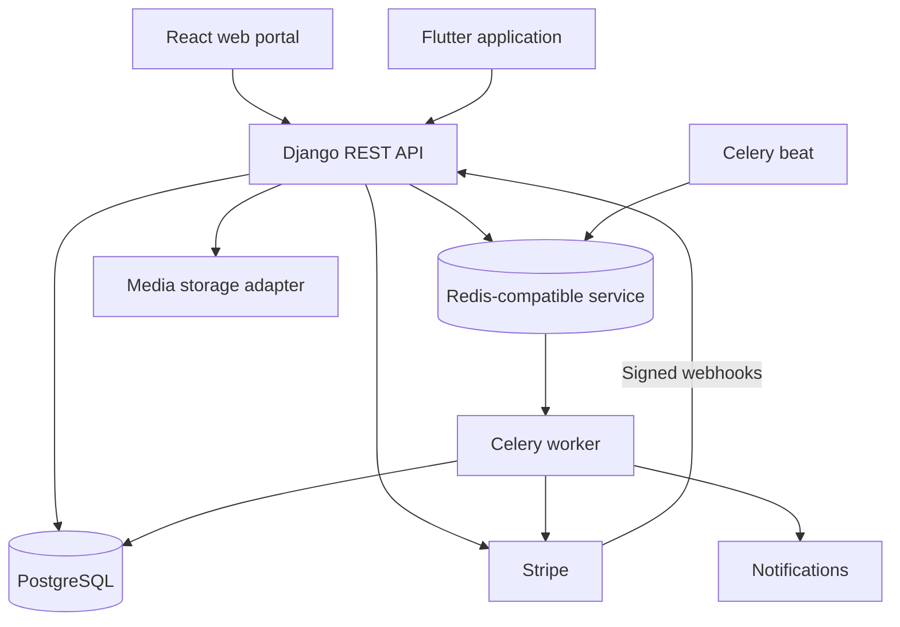
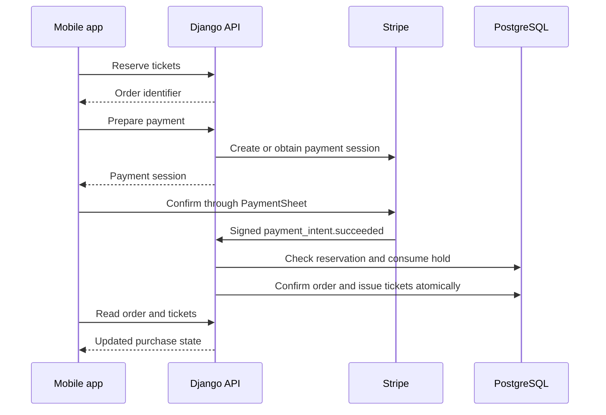
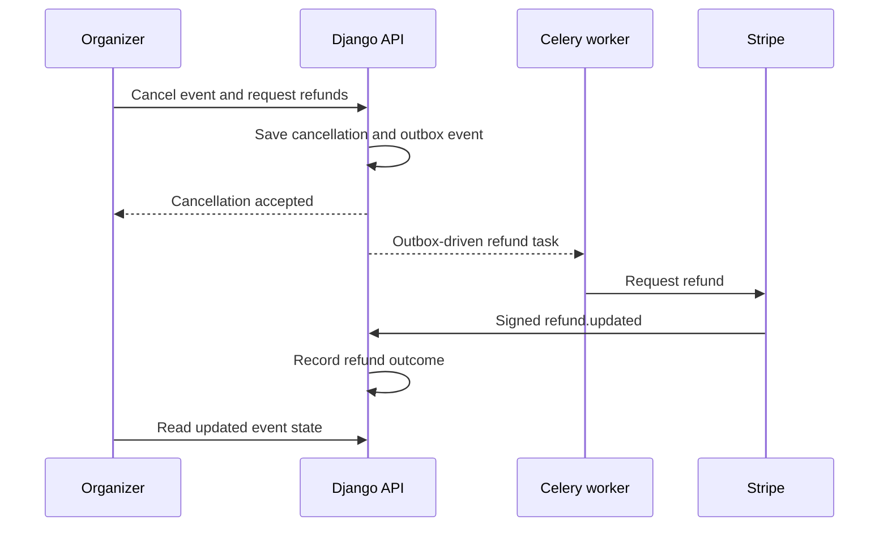
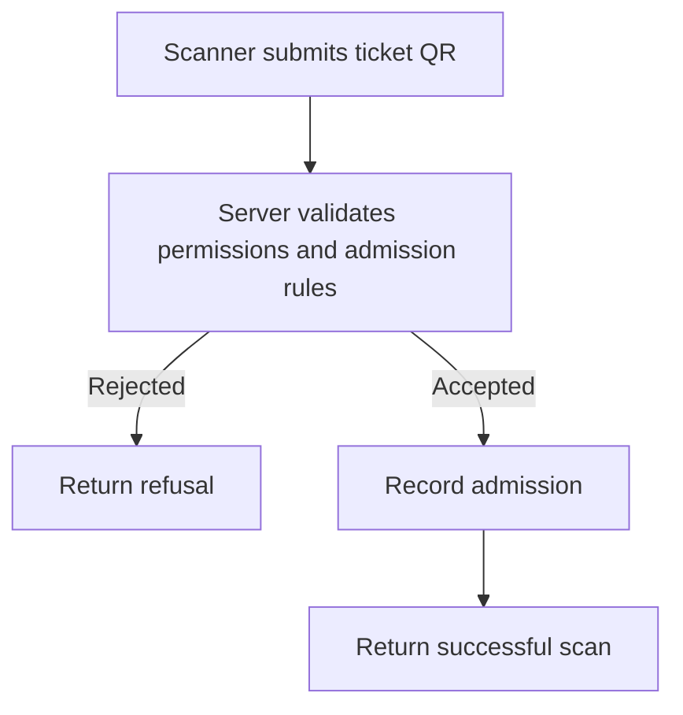

# System and workflow diagrams

These diagrams describe the main components and business flows of FAN iD. They summarize application behavior rather than every internal call.

## Application structure

Local development uses Docker Compose. The hosted demonstration uses Cloudflare Pages for the web portal, Render for the backend and data services, and Cloudflare R2 for media. API and workers share server-side configuration.

## Purchase and ticket issuance

Ticket issuance and order confirmation share a transaction. Payment received after reservation expiry needs reconciliation; it must not be treated as an automatically valid ticket purchase.

## Event cancellation and refund

Refunds may finish after the cancellation response. Check both the provider outcome and the application state.

## Admission validation

Ticket validity and duplicate-entry protection are enforced by the backend, not by the QR display alone.

## Related documents

- [Architecture](../adr/README.md)
- [API reference](../api/README.md)
- [Project README](../../README.md)
