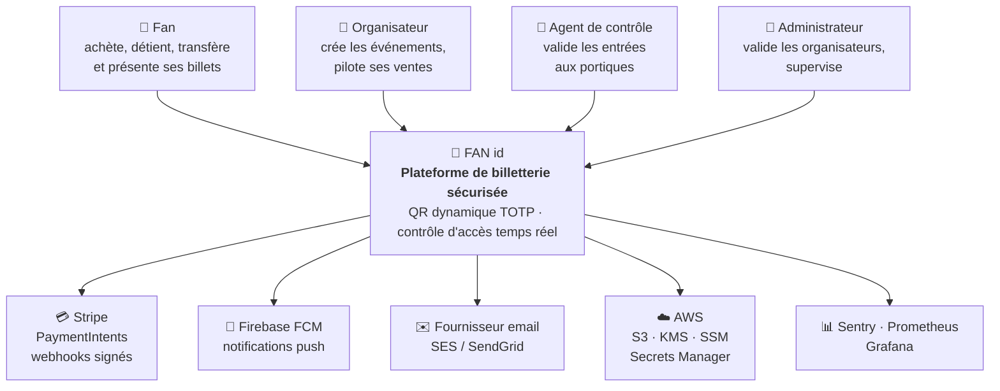
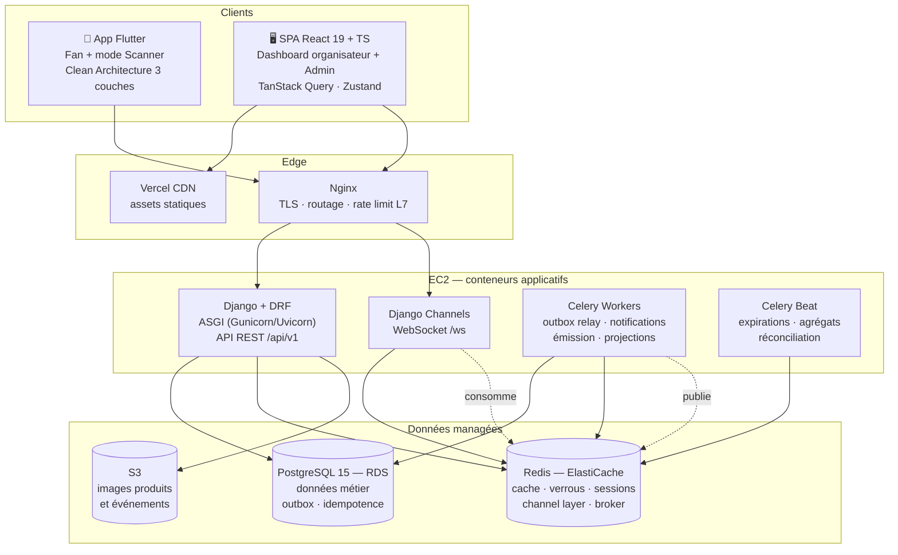
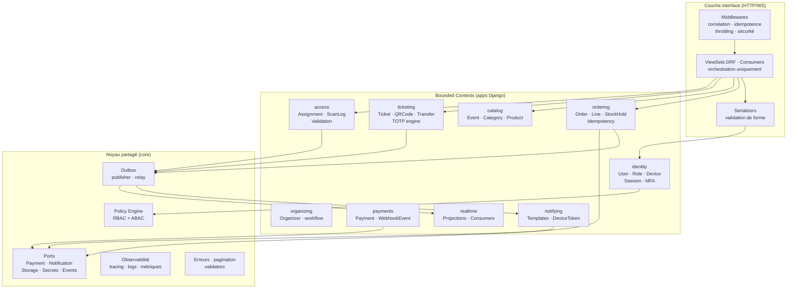
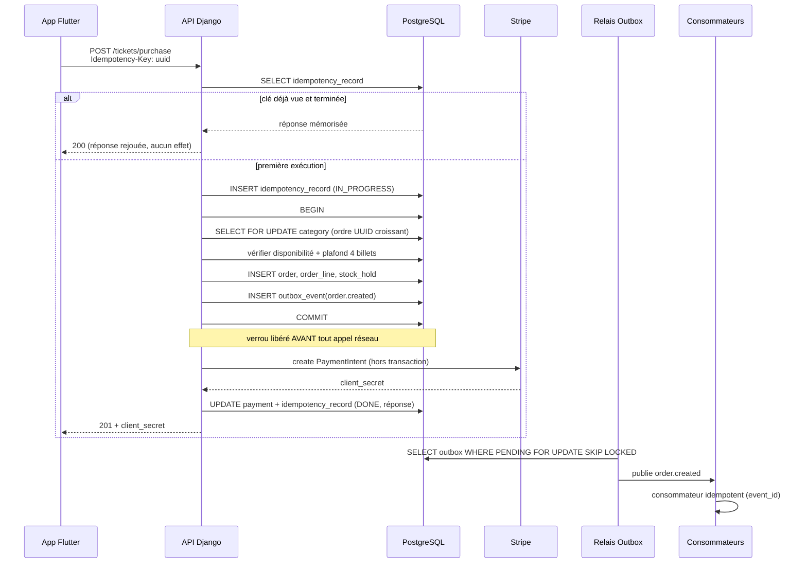

# Source A — Audit révisé et architecture globale

> Copie figée, à la date du Sprint 0, de la Section 1 du plan de
> développement v2 (`plan-dev-v2/01-audit-architecture-c4-adr.md` dans le
> projet Claude source). Référencée comme **« Source A »** dans le master
> prompt d'implémentation du Sprint 0 (priorité 1 dans la hiérarchie des
> sources, voir `docs/plan/README.md`) et dans `docs/adr/`.
>
> Toute modification de l'architecture décrite ici doit d'abord être actée
> dans le plan de développement source, puis répercutée dans cette copie —
> jamais l'inverse.

---

# SECTION 1 — Audit révisé et architecture globale

## 1.1 Réponse d'architecture à l'audit critique

Avant d'intégrer les corrections, un Principal Architect doit trier ce qui améliore le système de ce qui ajoute du poids sans valeur. **Neuf recommandations sur douze sont intégrées telles quelles. Trois sont refusées et remplacées par leur équivalent correct pour cette stack.** Chaque refus est justifié : accepter une recommandation techniquement inadaptée par déférence serait la faute professionnelle la plus grave de ce document.

### 1.1.1 Recommandations intégrées intégralement

| # | Recommandation de l'audit | Décision | Où elle est traitée |
|---|---|---|---|
| 1 | **Sprint 0 Plateforme** en amont | ✅ **Intégrée** — c'était le trou n°1 du plan v1 (risque R-02) | Sprint 0 complet |
| 2 | **Réévaluation des estimations** avec coefficient de charge réel | ✅ **Intégrée** — coefficient 1,8 à 3,0 selon la nature du bloc, justifié bloc par bloc | §2.2, §2.3 |
| 3 | **Rotation + révocation des refresh tokens** (blacklist Redis TTL) | ✅ **Intégrée** et durcie : détection de réutilisation ⇒ révocation de la famille entière | Sprint 1 §3.3 |
| 4 | **Device fingerprinting + session binding + step-up MFA** | ✅ **Intégrée** — clarifie le « verrou d'appareil » flou du dossier d'architecture | Sprint 1 §2.4 |
| 5 | **RBAC/ABAC formalisé dès le Sprint 1** | ✅ **Intégrée** — RBAC pour les capacités, ABAC pour le périmètre (tenant, événement) | Sprint 1 §5.2 |
| 6 | **Idempotency Keys** sur les opérations financières | ✅ **Intégrée** — clé client obligatoire sur achat, transfert, remboursement futur | Sprint 3 §3.3 |
| 7 | **Transactional Outbox Pattern** | ✅ **Intégrée** — table `outbox_event`, relais, garantie *at-least-once*, consommateurs idempotents | Sprint 3 §3.3, Sprint 4 §2 |
| 8 | **États UI explicites** (`loading`/`error`/`empty`/`success`) + Skeletons + Retry | ✅ **Intégrée** — matrice d'états obligatoire par écran, opposable en revue | Tous les sprints, §4.2 |
| 9 | **React Query / SWR** pour cache client, revalidation, mode dégradé | ✅ **Intégrée** — TanStack Query était déjà imposé par [DOC §7.1], la stratégie est désormais spécifiée (staleTime, retry, offline) | Sprint 2 §4, Sprint 4 §4 |
| 10 | **OpenTelemetry, logs structurés, RED/USE, Correlation IDs** | ✅ **Intégrée** — OTel SDK Python + propagation W3C `traceparent` jusqu'aux tâches asynchrones | Sprint 0 §5 |
| 11 | **Optimistic locking / versioning** contre l'overselling | ⚠️ **Intégrée avec correction technique** — voir §1.1.2 point C | Sprint 2 §3.1 |
| 12 | **Cache read-heavy (Redis/CDN)**, pagination scalable, index explicites | ✅ **Intégrée** — stratégie de cache à trois niveaux et invalidation par événement | Sprint 2 §3.4 |

### 1.1.2 Recommandations refusées ou corrigées — avec justification

#### A. **Flyway / Liquibase → refusé. Migrations Django + politique expand/contract.**

**Le problème** : Flyway et Liquibase sont des outils de l'écosystème **JVM**. La stack imposée par le dossier d'architecture est **Django/Python** [DOC §6, §9]. Introduire Flyway signifierait :

- gérer le schéma **en dehors** de l'ORM ⇒ perte de `makemigrations`, des contraintes déclaratives, de la cohérence modèle/schéma ;
- une divergence garantie entre `models.py` et la base, que Django détecterait comme des migrations manquantes à chaque `--check` en CI ;
- un runtime Java à installer dans l'image Docker de production, pour un gain nul.

**Ce que l'audit visait réellement** — et c'est un besoin légitime : *des migrations versionnées, revues, réversibles, exécutées de façon contrôlée en production, sans downtime*. Cela s'obtient dans Django par :

| Exigence | Mise en œuvre Django |
|---|---|
| Versionnement | Migrations numérotées, committées, revues en PR |
| Revue du SQL réel | `python manage.py sqlmigrate <app> <n>` **obligatoire en PR** pour toute migration touchant une table > 10 000 lignes |
| Détection de dérive | `makemigrations --check --dry-run` bloquant en CI |
| Sécurité des migrations | `django-migration-linter` en CI : refuse `NOT NULL` sans défaut, `ALTER COLUMN` bloquant, index non concurrent |
| Zéro downtime | **Politique expand/contract** formalisée en Sprint 0 : (1) ajouter la colonne nullable + backfill par lots, (2) déployer le code qui écrit les deux, (3) déployer le code qui lit la nouvelle, (4) contracter |
| Index en production | `AddIndexConcurrently` (PostgreSQL `CREATE INDEX CONCURRENTLY`) dans une migration `atomic = False` — **un `CREATE INDEX` classique verrouille la table en écriture** |
| Réversibilité | `RunPython(forward, reverse)` obligatoire ; migration non réversible = refus en PR sauf justification écrite |

**Verdict** : l'intention de l'audit est intégrée à 100 %, l'outil est remplacé par celui de la stack.

#### B. **Kafka / SQS-SNS en V1 → refusé. Outbox + relais Celery, derrière un port `EventPublisher`.**

**Le problème** : le pattern Outbox est excellent et je l'intègre. Le **broker distribué** ne l'est pas ici :

- Le déploiement cible est **un EC2 unique** [DOC §16.3]. Kafka exige un cluster (ZooKeeper/KRaft, réplication, rétention, monitoring) : le coût opérationnel dépasse celui de toute l'application.
- Le volume réel : quelques milliers d'événements par match. Kafka est dimensionné pour des millions par seconde. **Utiliser Kafka ici, c'est acheter un semi-remorque pour livrer une pizza** — et le jury le verra.
- SQS/SNS est plus raisonnable, mais ajoute une dépendance réseau AWS sur un chemin déjà couvert par Celery/Redis, déjà présents dans l'architecture pour l'asynchrone [DOC §6].

**Ce que l'audit visait réellement** : *garantir qu'un effet de bord (email, push, métrique, projection) ne soit jamais perdu ni dupliqué, et découpler le producteur du consommateur*. Cela s'obtient sans broker distribué :

```
Transaction métier ─┬─> écriture des données métier
                    └─> INSERT dans outbox_event   (même transaction, donc atomique)
                                │
                    Relais (Celery Beat, toutes les 2 s, SKIP LOCKED)
                                │
                    EventPublisher (port) ──> InProcessBus (V1)
                                          └─> SqsPublisher / KafkaPublisher (V2, sans refonte)
                                │
                    Consommateurs idempotents (clé = event_id, table consumed_event)
```

**Garanties obtenues, identiques à celles d'un broker** : atomicité producteur/événement (le point dur du problème), livraison *at-least-once*, retries avec backoff, DLQ (`status='DEAD'` + alerte), ordre par agrégat (tri sur `aggregate_id, sequence`), traçabilité complète.

**Ce qu'on n'a pas** : le fan-out multi-consommateurs à très haut débit et la rétention/replay longue durée — deux besoins que ce système n'a pas en V1.

**Verdict** : pattern intégré, transport dimensionné. Le port `EventPublisher` rend la bascule vers SQS ou Kafka **une décision de configuration**, pas une refonte. C'est exactement ce que signifie « architecture extensible » [DOC §1].

#### C. **Optimistic locking pour l'overselling → corrigé. Stratégie hybride.**

**Le problème technique** : sur la ressource la plus disputée du système — la ligne `category` d'une catégorie qui se vend en quelques secondes — le verrouillage **optimiste est le mauvais choix**. Sous forte contention, chaque transaction lit `version=N`, tente d'écrire, échoue sur conflit, et rejoue. Avec 100 acheteurs simultanés sur les dernières places, on obtient un taux d'échec proche de 99 % et un effondrement du débit par *livelock* : le système passe son temps à rejouer.

Le verrouillage **pessimiste** (`SELECT FOR UPDATE`, déjà prescrit par [DOC §10.4]) sérialise les accès à cette ligne unique : chaque transaction attend son tour quelques millisecondes et **réussit**. C'est la bonne réponse pour une ressource à contention élevée et à section critique très courte.

**Inversement**, l'audit a raison là où le plan v1 était muet : sur les entités éditées par les organisateurs (`event`, `category` en édition, `product`), le risque n'est pas la survente mais **l'écrasement silencieux de modifications concurrentes** (*lost update*) — deux onglets ouverts, deux admins d'un même club. Là, le verrouillage optimiste par `version` est la réponse correcte, et le verrouillage pessimiste serait absurde (on ne verrouille pas une ligne pendant qu'un humain remplit un formulaire).

**Décision (ADR-S-05)** — stratégie hybride, chaque mécanisme là où il est correct :

| Ressource | Contention | Mécanisme | Justification |
|---|---|---|---|
| `category` (achat, décrément du disponible) | **Très élevée**, section critique < 20 ms | **Pessimiste** `SELECT FOR UPDATE` + `CHECK (sold_count <= quota)` | Sérialisation courte, aucun rejeu, invariant garanti par le SGBD |
| `ticket` (validation au scan) | Élevée (double-scan), section critique < 10 ms | **Pessimiste** `SELECT FOR UPDATE` | Idem |
| `event`, `category` (édition organisateur) | Faible, latence humaine | **Optimiste** `version` + `If-Match`/ETag ⇒ `409 STALE_RESOURCE` | Empêche le *lost update*, aucun verrou pendant la saisie |
| `product.stock_level` | Moyenne | **Pessimiste** à l'achat, **optimiste** à l'édition | Même raisonnement |
| `organizer.validation_status` | Très faible | **Optimiste** | Deux admins concurrents |

**Verdict** : l'audit avait raison d'exiger un contrôle de concurrence explicite ; il se trompait de mécanisme sur le chemin d'achat. Les deux sont intégrés, chacun à sa place. **Savoir expliquer ce choix en soutenance vaut plus que d'appliquer un seul mécanisme partout.**

#### D. **HashiCorp Vault → remplacé par AWS SSM Parameter Store + KMS (Secrets Manager pour la clé QR).**

Vault est un excellent produit, mais c'est **un cluster à opérer** (unseal, HA, backup, renouvellement de certificats). Sur un projet mono-EC2, il ajoute une dépendance critique dont la panne rend l'application indémarrable, pour un bénéfice nul par rapport aux services managés déjà présents dans le compte AWS du projet.

| Besoin | Solution retenue | Pourquoi |
|---|---|---|
| Secrets applicatifs (DB, Redis, Stripe, SMTP) | **SSM Parameter Store `SecureString`** chiffré par **KMS**, lu au démarrage via rôle IAM d'instance | Gratuit jusqu'à 10 000 paramètres, versionné, audité par CloudTrail, aucune infrastructure à opérer |
| **Clé de chiffrement des graines TOTP** | **AWS Secrets Manager** avec rotation planifiée + `key_version` en base | La rotation automatisée justifie ici le surcoût : c'est le secret dont la perte invalide **tous** les billets |
| Secrets de CI | GitHub Actions Secrets + OIDC vers un rôle IAM (**aucune clé AWS de longue durée dans GitHub**) | Élimine la classe entière des fuites de clés statiques |
| Développement local | `.env` hors dépôt + `detect-secrets` en pre-commit | Simplicité |

**Verdict** : l'exigence « pas de secret dans le code, rotation possible, audit » est satisfaite intégralement. L'outil est dimensionné.

### 1.1.3 Tableau de synthèse des écarts

| Recommandation | Statut | Substitut | Exigence sous-jacente satisfaite ? |
|---|---|---|---|
| Flyway/Liquibase | ❌ Refusé | Migrations Django + expand/contract + migration-linter | ✅ Oui, intégralement |
| Kafka / SQS-SNS | ❌ Refusé en V1 | Outbox + relais Celery derrière port `EventPublisher` | ✅ Oui (atomicité, at-least-once, retry, DLQ) |
| HashiCorp Vault | ❌ Refusé | SSM Parameter Store + KMS + Secrets Manager | ✅ Oui |
| Optimistic locking partout | ⚠️ Corrigé | Hybride pessimiste/optimiste selon la contention | ✅ Oui, et mieux |
| Les 9 autres | ✅ Intégrées | — | ✅ |

---

## 1.2 Résumé exécutif révisé

### 1.2.1 Ce que le plan v2 change par rapport au plan v1

| Axe | Plan v1 | Plan v2 | Effet |
|---|---|---|---|
| **Découpage** | 5 sprints, bootstrap noyé dans S1 | **6 sprints**, dont un **Sprint 0 Plateforme** autonome | La plateforme cesse d'être une dette implicite |
| **Estimations** | 29 jours ouvrés | **59 jours ouvrés** (trajectoire produit) / **32 jours** (trajectoire PFE re-scopée) | Fin de la sous-estimation structurelle |
| **Sécurité** | JWT + verrou d'appareil décrits fonctionnellement | **Zero Trust** : rotation/révocation, fingerprinting, binding de session, step-up MFA, RBAC+ABAC formalisé | Modèle d'autorisation opposable et testable |
| **Concurrence** | Verrou pessimiste sur l'achat | **Stratégie hybride** documentée par ressource + versioning ETag | Couvre aussi le *lost update*, absent du v1 |
| **Cohérence** | Appels directs (email, push, métriques) après transaction | **Transactional Outbox** + consommateurs idempotents | Plus aucun effet de bord perdu en cas de crash |
| **Idempotence** | Webhook Stripe seulement | **Idempotency-Key** sur toutes les mutations financières + table dédiée | Achat rejoué par un réseau instable ⇒ une seule commande |
| **Observabilité** | Sentry + Prometheus en fin de projet | **OTel + logs JSON + RED/USE + correlation ID dès le Sprint 0** | On instrumente avant de coder, pas après |
| **Frontend** | États d'écran mentionnés | **Matrice d'états obligatoire** par écran + politique de retry + mode dégradé | Opposable en revue de code |
| **Migrations** | Migrations Django committées | **Politique expand/contract + linter + `sqlmigrate` en PR** | Déploiements sans verrou de table |

### 1.2.2 Verdict d'architecture

Le système reste un **monolithe modulaire Django orienté domaine**, et c'est le bon choix : les frontières logiques sont posées (bounded contexts = apps Django), la cohérence transactionnelle est garantie par une base unique, et l'extraction éventuelle d'un service (contrôle d'accès temps réel, par exemple) reste possible parce que la communication interne passe déjà par des **événements** et des **ports**.

**Ce que ce plan v2 refuse explicitement** : la complexité distribuée prématurée. Un système en microservices avec Kafka développé par une personne en trois mois ne serait ni terminé, ni correct, ni défendable. Le niveau FAANG ne se mesure pas au nombre de composants d'infrastructure, mais à la **rigueur des invariants** : atomicité, idempotence, contrôle d'accès, observabilité, tests de concurrence. C'est cette rigueur que le plan v2 impose.

### 1.2.3 Les cinq invariants non négociables du système

Ces cinq propriétés doivent rester vraies à tout instant, sous n'importe quelle charge et n'importe quelle panne. Chacune est protégée à **deux niveaux au minimum** (base + application) et couverte par un test de concurrence dédié.

| # | Invariant | Protection niveau 1 (SGBD) | Protection niveau 2 (application) | Test |
|---|---|---|---|---|
| **I-1** | Jamais plus de billets vendus que le quota | `CHECK (sold_count <= quota)` | `SELECT FOR UPDATE` sur `category` | 100 achats concurrents sur 50 places |
| **I-2** | Un billet ne peut être consommé qu'une fois | Statut `USED` terminal + `CHECK` de transition | `SELECT FOR UPDATE` sur `ticket` | 10 scans simultanés du même billet |
| **I-3** | Une commande payée émet exactement un jeu de billets | `UNIQUE(stripe_event_id)` sur `webhook_event` | Idempotence de la tâche + verrou sur `order` | Webhook rejoué 5 fois |
| **I-4** | Une requête d'achat rejouée ne crée qu'une commande | `UNIQUE(idempotency_key, user_id)` | Table `idempotency_record` avec réponse mémorisée | Même requête envoyée 5 fois en parallèle |
| **I-5** | Aucun effet de bord validé n'est perdu | `outbox_event` écrit dans la transaction métier | Relais avec retry + DLQ | Crash simulé entre commit et publication |

**[RECO]** Ce tableau est le meilleur support de soutenance du projet : cinq lignes qui montrent qu'on a identifié ce qui doit rester vrai, et qu'on l'a protégé deux fois plutôt qu'une.

---

## 1.3 Objectifs métier et contraintes

### 1.3.1 Objectifs métier (rappel du dossier d'architecture, inchangés)

| # | Objectif [DOC] | Traduction en propriété système | Sprint |
|---|---|---|---|
| OM-1 | Neutraliser la fraude par capture d'écran | TOTP 30 s serveur, graine chiffrée jamais exposée | S3 |
| OM-2 | Contrôle d'accès temps réel, tracé, non rejouable | Validation transactionnelle, `scan_log` exhaustif | S4 |
| OM-3 | Parcours d'achat unifié billets + produits | Commande unique, lignes polymorphes, hold 10 min | S3 |
| OM-4 | Pilotage organisateur par dashboard | Projections de lecture + flux temps réel | S4 |
| OM-5 | Tenue de charge (50 000 billets, centaines de scanners) | p95 < 300 ms sur le scan, **prouvé par test de charge** | S5 |
| OM-6 | Revenu : commission + TVA modélisées | Montants figés à la commande, en centimes | S3 |

### 1.3.2 Contraintes de niveau « FAANG » retenues, et leur coût

Un standard d'ingénierie n'a de sens que si l'on en assume le coût. Voici ce que chaque exigence coûte réellement dans ce projet.

| Exigence | Ce qu'elle impose concrètement | Coût (jours) | Retenue ? |
|---|---|---|---|
| Tout invariant protégé en base **et** en applicatif | 6 contraintes `CHECK`, 4 index uniques partiels | +1 j | ✅ |
| Idempotence de toute mutation non-GET sensible | Table + middleware + tests | +1,5 j | ✅ |
| Outbox pour tout effet de bord | Table, relais, consommateurs, DLQ, supervision | +2,5 j | ✅ |
| Observabilité dès la première ligne | OTel, logs JSON, RED/USE, correlation ID | +3 j (S0) | ✅ |
| Tests de concurrence obligatoires | 8 scénarios multi-threads | +2 j | ✅ |
| Test de charge avec cible chiffrée | Scénarios k6, mesure, optimisation, rapport | +2 j | ✅ |
| Zero downtime deployment | Expand/contract, index concurrents, health checks | +1,5 j | ✅ |
| Chaos engineering | Injection de pannes (Redis, Celery, Stripe) | +3 j | ⚠️ **Version légère** (4 pannes simulées manuellement, 0,5 j) |
| Multi-AZ / haute disponibilité | ALB, 2 AZ, réplique RDS, autoscaling | +5 j et coût AWS ×3 | ❌ **Refusé en V1** — documenté comme trajectoire V2 |
| Service mesh, microservices | — | +20 j | ❌ **Refusé** — voir §1.2.2 |

**Total du surcoût « qualité » assumé : ≈ 14 jours ouvrés.** C'est précisément l'écart entre un prototype qui fonctionne le jour de la démonstration et un système dont on peut prouver les propriétés. Cet arbitrage doit être **conscient** : il est la raison principale du rebase des estimations en §2.

### 1.3.3 Contraintes de contexte (non négociables)

| Contrainte | Valeur | Conséquence sur le plan |
|---|---|---|
| Équipe | **1 développeur** (projet de fin d'études) | Aucun parallélisme : la somme des tâches = la durée. Coût de changement de contexte entre 3 stacks à intégrer dans les estimations |
| Fenêtre | ~45 jours calendaires, soutenance ferme | Impose la trajectoire B (§2.3) ou un re-scope explicite |
| Stack | Django / DRF / Channels / Celery / PostgreSQL / Redis / React / Flutter | Interdit Flyway, impose les migrations Django |
| Infrastructure | 1 EC2, RDS, ElastiCache, S3, Vercel | Interdit Kafka, un cluster Vault, le multi-AZ |
| Paiement | Stripe centralisé, clés de test | PCI délégué, pas de reversement en V1 |
| Démonstration | Android physique + navigateur | iOS optionnel, WebSocket avec repli obligatoire |

---

## 1.4 Architecture cible — modèle C4

### 1.4.1 Niveau 1 — Contexte système



**Frontières du système** : FAN id est responsable de l'identité, du catalogue, de la commande, de l'émission du billet, de son secret cryptographique et du contrôle d'accès. Il **délègue** l'encaissement (Stripe, périmètre PCI), le transport des notifications, le stockage objet et la gestion des secrets.

### 1.4.2 Niveau 2 — Conteneurs



**Décision structurante** : `API`, `WS`, `WRK` et `BEAT` sont **quatre conteneurs distincts partageant la même image**. Motif : un pic de scans ne doit pas être ralenti par l'envoi d'emails, et un worker bloqué ne doit pas rendre l'API indisponible. C'est de l'isolation de ressources sans le coût des microservices — le meilleur rapport bénéfice/complexité de cette architecture.

### 1.4.3 Niveau 3 — Composants du conteneur API (bounded contexts)



**Règles de dépendance, vérifiées automatiquement en CI (`import-linter`)** :

1. `core` ne dépend d'**aucun** bounded context.
2. Un bounded context ne peut **jamais** importer le `services/` d'un autre. La communication passe par : (a) un événement Outbox pour l'asynchrone, (b) une interface publique explicite `<context>/api.py` pour le synchrone.
3. La couche interface (views) ne contient aucune règle métier.
4. Aucune dépendance circulaire entre contextes.

**Pourquoi automatiser cette vérification** : sans contrainte outillée, ces règles sont violées en trois semaines. Un fichier `.importlinter` de 30 lignes et une étape de CI transforment une intention d'architecture en propriété vérifiée à chaque commit. C'est ce qui distingue une architecture *décrite* d'une architecture *tenue*.

### 1.4.4 Flux de référence — achat idempotent avec Outbox



---

## 1.5 Décisions d'architecture stratégiques (ADR)

Les ADR tactiques (20) du plan v1 restent valides et sont rappelés en annexe. Les huit ADR **stratégiques** ci-dessous sont nouveaux ou révisés ; ils conditionnent la structure du code et doivent être tranchés **avant le Sprint 0**.

### ADR-S-01 — Monolithe modulaire orienté domaine (DDD stratégique)

- **Statut** : Accepté · **Contexte** : 1 développeur, 3 mois, cohérence transactionnelle forte requise (I-1 à I-5).
- **Options** : (A) monolithe en couches technique (views/models/services globaux) · (B) **monolithe modulaire par bounded context** · (C) microservices.
- **Décision** : **B**.
- **Justification** : les invariants I-1 à I-4 exigent des transactions ACID sur plusieurs agrégats (catégorie + commande + billet). En microservices, il faudrait des sagas compensatoires pour chaque achat — complexité multipliée par cinq pour un bénéfice nul à cette échelle. Le découpage en bounded contexts capture 90 % du bénéfice organisationnel du DDD sans le coût distribué.
- **Bounded contexts et langage ubiquitaire** :

| Contexte | Agrégat racine | Vocabulaire propre | Ne connaît pas |
|---|---|---|---|
| `identity` | User | Compte, Rôle, Appareil, Session, Verrou | Les billets, les commandes |
| `organizing` | Organizer | Demande, Validation, Commission | Le catalogue détaillé |
| `catalog` | Event | Événement, Catégorie, Quota, Produit, Disponibilité | Les commandes, les paiements |
| `ordering` | Order | Panier, Ligne, Réservation, Montant figé | Le QR, le scan |
| `payments` | Payment | Intent, Webhook, Confirmation | Le contenu de la commande |
| `ticketing` | Ticket | Billet, Graine, Jeton, Transfert | Le paiement |
| `access` | ScanLog | Affectation, Validation, Verdict, Périmètre | Le prix, la commande |
| `notifying` | — | Canal, Modèle, Destinataire | Le métier |
| `realtime` | — | Projection, Canal, Métrique | Le métier |

- **Conséquences** : ✅ frontières explicites, extraction future possible · ✅ tests par contexte · ❌ discipline requise (outillée par `import-linter`) · ❌ certaines requêtes inter-contextes passent par une interface publique plutôt qu'une jointure directe (coût assumé, gain de découplage).

### ADR-S-02 — CQRS léger (séparation des modèles de lecture, pas des bases)

- **Statut** : Accepté · **Options** : (A) aucun CQRS · (B) **séparation lecture/écriture dans le même stockage** · (C) CQRS complet avec bases séparées et projections asynchrones.
- **Décision** : **B**, avec une exception ciblée en C pour les métriques temps réel.
- **Justification** : les charges de lecture (catalogue, mes billets, dashboard) et d'écriture (achat, scan) ont des profils opposés, mais une base unique les absorbe largement à cette volumétrie. C introduirait une cohérence à terme sur des données que l'utilisateur s'attend à voir immédiatement (« j'ai acheté, où est mon billet ? ») — **une mauvaise expérience payée au prix fort**.
- **Mise en œuvre** : `services/` (écriture, invariants, transactions) vs `selectors.py` (lecture, requêtes annotées, aucun effet de bord) · serializers de lecture ≠ serializers d'écriture · **exception** : les métriques de scan sont pré-agrégées dans une projection (`event_metrics_snapshot`) alimentée par les événements Outbox — un `COUNT(*)` sur 50 000 `scan_log` à chaque tick de dashboard est le seul cas où la lecture directe ne tient pas.

### ADR-S-03 — Event-Driven interne via Transactional Outbox

- **Statut** : Accepté (remplace la recommandation Kafka de l'audit) · **Justification détaillée** : §1.1.2 B.
- **Contrat d'événement** (stable, versionné) :

```
{ event_id, event_type, event_version, aggregate_type, aggregate_id,
  occurred_at, correlation_id, causation_id, actor_id, payload{...} }
```

- **Catalogue d'événements V1** : `order.created` · `order.paid` · `order.failed` · `order.expired` · `tickets.issued` · `ticket.transferred` · `ticket.scanned` · `scan.rejected` · `organizer.approved` · `organizer.rejected` · `device.reset` · `hold.expired`.
- **Garanties** : atomicité producteur/événement (même transaction) · at-least-once · ordre par agrégat · retry exponentiel (5 tentatives : 2 s, 8 s, 32 s, 2 min, 8 min) puis `DEAD` + alerte · **consommateurs obligatoirement idempotents** (table `consumed_event(consumer_name, event_id)` en clé primaire composite).
- **Conséquences** : ✅ aucun effet de bord perdu même en cas de crash entre le commit et la publication · ✅ découplage : ajouter un consommateur ne modifie pas le producteur · ❌ latence de 0 à 2 s sur les effets de bord (acceptable : email, push, métriques) · ❌ une table et un relais à superviser.

### ADR-S-04 — Zero Trust appliqué à l'API

- **Statut** : Accepté · **Principe** : aucune requête n'est de confiance, même authentifiée, même interne.
- **Sept règles appliquées sans exception** :

| # | Règle | Mise en œuvre |
|---|---|---|
| 1 | Deny by default | `DEFAULT_PERMISSION_CLASSES = [IsAuthenticated]` ; ouvrir est un acte explicite et revu |
| 2 | Authentifier **et** autoriser à chaque requête | Aucune décision d'autorisation mise en cache côté client ; le rôle est revérifié serveur |
| 3 | Périmètre déduit du serveur, jamais du client | L'événement d'un scan vient de `ticket.category.event`, jamais du corps de la requête |
| 4 | Moindre privilège | Rôles à capacités minimales ; IAM d'instance limité à un bucket |
| 5 | Secrets jamais en clair | SSM/KMS ; rédaction automatique dans les logs |
| 6 | Tout accès sensible journalisé | Login, scan, transfert, paiement, action admin |
| 7 | Défense en profondeur | Chaque invariant protégé deux fois (I-1 à I-5) |

### ADR-S-05 — Contrôle de concurrence hybride

- **Statut** : Accepté (corrige la recommandation de l'audit) · **Justification et matrice** : §1.1.2 C.
- **Conséquence d'interface** : les ressources en verrouillage optimiste exposent un **ETag** et exigent `If-Match` sur les mutations ; un conflit renvoie `409 STALE_RESOURCE` avec la version courante, et l'interface propose « recharger et fusionner ». Sans cet aller-retour, l'optimisme est invisible pour l'utilisateur et produit une perte de saisie silencieuse.

### ADR-S-06 — Idempotence de toutes les mutations sensibles

- **Statut** : Accepté · **Portée** : `POST /tickets/purchase`, `POST /tickets/transfer`, `POST /transfers/{token}/accept`, `POST /orders/{id}/cancel`, `POST /payments/webhook`, `POST /scan/validate`.
- **Mécanisme** : en-tête `Idempotency-Key` (UUID v4 généré par le client) → table `idempotency_record(key, user_id, endpoint, request_hash, status, response_body, response_status, created_at, expires_at)` avec `UNIQUE(key, user_id)`.
- **Règles fines** : même clé + même empreinte de requête ⇒ réponse mémorisée rejouée · même clé + **empreinte différente** ⇒ `422 IDEMPOTENCY_KEY_REUSE` (le client a un bug, il faut le lui dire) · exécution en cours ⇒ `409 REQUEST_IN_PROGRESS` (le client retente) · rétention 24 h.
- **Cas particulier du scan** : l'idempotence y est **naturelle** (le statut `USED` est terminal). On y ajoute une clé pour que le rejeu réseau de l'application scanner renvoie le **même verdict** plutôt qu'un `TICKET_ALREADY_USED` trompeur pour l'agent — détail d'expérience utilisateur qui évite des refus perçus comme des bugs au portique.

### ADR-S-07 — Observabilité de premier ordre, dès le Sprint 0

- **Statut** : Accepté · **Décision** : l'instrumentation est une **exigence fonctionnelle**, livrée au Sprint 0, pas une option de fin de projet.
- **Trois piliers** : traces (OpenTelemetry, propagation W3C `traceparent` jusque dans les tâches Celery et les consumers WebSocket) · logs (JSON structuré, `correlation_id` sur 100 % des lignes, rédaction automatique des secrets) · métriques (**RED** pour les services : Rate, Errors, Duration ; **USE** pour les ressources : Utilization, Saturation, Errors).
- **Métriques métier obligatoires** (au-delà de l'infrastructure) : `fanid_scan_total{result,reason}` · `fanid_scan_duration_seconds` · `fanid_purchase_total{status}` · `fanid_stock_hold_active` · `fanid_outbox_pending` · `fanid_outbox_dead` · `fanid_totp_verification_total{result}`.
- **Justification** : `fanid_outbox_pending` qui croît sans redescendre est le signal d'un relais arrêté — panne silencieuse qui ne produit aucune erreur HTTP et qu'aucune métrique d'infrastructure ne révèle. **Les pannes les plus dangereuses de ce système sont silencieuses ; seules les métriques métier les rendent visibles.**

### ADR-S-08 — Migrations Django avec politique expand/contract

- **Statut** : Accepté (remplace Flyway/Liquibase) · **Justification** : §1.1.2 A.
- **Règles opposables en PR** : `sqlmigrate` joint à toute migration touchant une table volumineuse · index créés en `CONCURRENTLY` (`atomic = False`) · aucun `NOT NULL` sans valeur par défaut sur table peuplée · backfill par lots dans une migration séparée, jamais dans la même que l'ajout de colonne · réversibilité obligatoire · `django-migration-linter` bloquant en CI.
