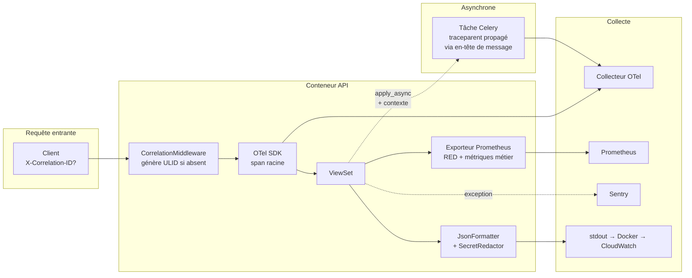

# Source B — Spécification opérationnelle du Sprint 0

> Copie figée, à la date du Sprint 0, du plan de développement v2
> (`plan-dev-v2/03-sprint-0-plateforme.md` dans le projet Claude source).
> Référencée comme **« Source B »** dans le master prompt d'implémentation
> du Sprint 0 (priorité 2 dans la hiérarchie des sources, après Source A —
> voir `docs/plan/README.md`).
>
> Toute modification de la spécification décrite ici doit d'abord être
> actée dans le plan de développement source, puis répercutée dans cette
> copie — jamais l'inverse.

---

# SPRINT 0 — Plateforme, chaîne de livraison et observabilité

> **Trajectoire A** : 12,5 j · **Trajectoire B (retenue)** : 5 j — **J1 → J5**
> **Nouveau en v2** — ce sprint n'existait pas dans le plan v1 (risque R-02 : le bootstrap était supposé fait sans être planifié).

---

## 1. Présentation du Sprint

### 1.1 Objectif et valeur produite

Livrer une **plateforme d'ingénierie complète et instrumentée, sans aucune fonctionnalité métier**. À la fin du sprint, un développeur clone le dépôt, lance une commande, et dispose d'un environnement identique à la production, d'une chaîne de livraison qui refuse le code non conforme, et d'une observabilité qui permet de suivre une requête depuis le client jusqu'à une tâche asynchrone.

**Valeur produite** — elle est indirecte mais mesurable :

| Bénéfice | Mesure |
|---|---|
| Suppression de la taxe quotidienne d'environnement | ~30 min/jour × 40 jours = **20 jours-homme** économisés |
| Détection immédiate des régressions | Un test cassé bloque la PR au lieu d'être découvert trois sprints plus tard |
| Débogage par corrélation plutôt que par déduction | Un incident se diagnostique par `correlation_id` en minutes, pas en heures |
| Aucun secret dans l'historique Git | Un secret committé est **irréversible** — il faut réécrire l'historique et faire tourner toutes les clés |
| Patterns transverses disponibles avant le premier endpoint | Idempotence, Outbox, erreurs, pagination ne se rétro-appliquent pas |

### 1.2 Justification de l'ordonnancement

**Pourquoi ce sprint en premier — cinq raisons non négociables :**

1. **Les patterns transverses ne se rétro-appliquent pas.** Un format d'erreur, un `correlation_id`, une politique d'idempotence ajoutés au sprint 3 ne seront jamais appliqués rétroactivement aux 40 endpoints déjà écrits. Ce qui n'est pas dans le socle au premier endpoint n'y sera jamais.
2. **L'observabilité écrite après coup mesure le mauvais système.** On instrumente ce qu'on croit important quand on connaît déjà les réponses. Instrumenté avant, on découvre ce qu'on ne soupçonnait pas — par exemple qu'une requête de disponibilité déclenche 40 requêtes SQL.
3. **La CI qui arrive tard ne bloque jamais rien.** Une porte de qualité installée au sprint 5 constate les dégâts ; installée au sprint 0, elle les empêche.
4. **Le coût d'un secret committé est irréversible.** `.gitignore` et le scan de secrets doivent exister **avant le premier `git add`**, pas après.
5. **Le risque d'infrastructure doit être payé quand il reste du temps.** Découvrir à J35 qu'une image Docker ne se construit pas en production est un incident ; le découvrir à J3 est une information.

**Pourquoi il ne peut pas être fait en parallèle du sprint 1** : développeur seul. Toute tentative de « faire l'infra en fond de tâche » produit deux chantiers inachevés.

### 1.3 Prérequis et dépendances

| Prérequis | Type | Statut requis |
|---|---|---|
| **ADR-S-01 à S-08 tranchés** (Section 1.5) | Décision | ⛔ **Bloquant J1** |
| ADR tactiques J0 du plan v1 (mono/multi-rôles, TTC/HT, centimes, domaine, mono-repo, ASGI) | Décision | ⛔ **Bloquant J1** |
| Docker + Compose, Python 3.12, Node 20, Flutter SDK | Poste | Installé |
| Compte AWS + utilisateur IAM + accès SSM | Externe | J1 |
| Dépôt GitHub avec protection de `main` et `develop` | Externe | J1 |
| Décision sur le nom de domaine (ADR-05) | Décision | J1 (achat possible plus tard) |

**Dépendances sortantes** : **tous** les sprints. S0 est la racine absolue du graphe.

### 1.4 Estimation réévaluée

| Sous-lot | Traj. A | Traj. B | Difficulté | Risque principal |
|---|---|---|---|---|
| S0.1 Mono-repo, outillage, docker-compose | 2,0 j | 1,0 j | 🟡 Moyenne | Divergence dev/prod si l'image n'est pas la même |
| S0.2 Socle `core` (erreurs, pagination, modèles de base, ports) | 2,0 j | 1,0 j | 🟡 Moyenne | Sur-ingénierie du socle (YAGNI) |
| S0.3 CI/CD (5 pipelines, portes de qualité) | 2,0 j | 0,75 j | 🟡 Moyenne | Temps d'exécution de la CI trop long ⇒ contournée |
| S0.4 Secrets (SSM + KMS) et configuration | 1,5 j | 0,5 j | 🔴 Élevée | Fuite de secret · IAM mal configuré |
| S0.5 Observabilité (OTel, logs, métriques RED/USE) | 3,0 j | 1,0 j | 🔴 Élevée | Propagation de contexte perdue dans Celery |
| S0.6 Infrastructure d'idempotence et d'Outbox | 1,5 j | 0,5 j | 🔴 Élevée | Relais qui perd des événements sous concurrence |
| S0.7 Environnement AWS de base + sondes | 0,5 j | 0,25 j | 🟡 Moyenne | Coût AWS non maîtrisé |
| **Total** | **12,5 j** | **5,0 j** | | |

**Priorité** : 🔴 Maximale — bloque 100 % du projet.
**Risques majeurs** : (a) sur-ingénierie du socle — contre-mesure : le socle est *suffisant*, pas parfait, et sa DoD est fermée ; (b) apprentissage AWS sous-estimé — contre-mesure : périmètre S0 limité à SSM et IAM, le reste des services attend S5 ; (c) OpenTelemetry dans Celery — contre-mesure : test de propagation de trace écrit **avant** l'instrumentation.

---

## 2. Architecture et découpage technique

### 2.1 Modules créés

| Module | Contenu | Dépendances |
|---|---|---|
| `core` | Modèles de base, erreurs, pagination, policy (coquille), idempotency, outbox, observability, ports, adaptateurs | **Aucune** — règle absolue |
| `config` | Settings par environnement, URLs racine, ASGI, Celery | `core` |
| `infra/` | Nginx, collecteur OTel, Prometheus, scripts | — |

### 2.2 Composants du socle `core`

| Composant | Fichier | Responsabilité | Utilisé dès |
|---|---|---|---|
| `UUIDModel` | `core/models.py` | PK UUID v4 (exigence de sécurité : le QR expose l'UUID du billet [DOC §11] ; un ID séquentiel permettrait l'énumération) | S1 |
| `TimeStampedModel` | `core/models.py` | `created_at`, `updated_at` | S1 |
| `VersionedModel` ★ | `core/models.py` | `version` (entier), incrémenté à chaque `save()` — support du verrouillage optimiste (ADR-S-05) | S2 |
| `BusinessError` + hiérarchie | `core/exceptions.py` | `ValidationBusinessError` (400), `AuthError` (401), `PermissionBusinessError` (403), `NotFoundBusinessError` (404), `ConflictError` (409), `PreconditionFailed` (412), `UnprocessableError` (422), `RateLimitError` (429) | S1 |
| `custom_exception_handler` | `core/handlers.py` | Corps d'erreur unique + `correlation_id` + trace ID | S1 |
| `StandardPagination` / `CursorPagination` | `core/pagination.py` | Pagination par page (défaut) et par curseur (journaux volumineux) | S2 |
| `PolicyEngine` (coquille) | `core/policy/engine.py` | Point d'entrée unique d'autorisation ; implémenté en S1 | S1 |
| `IdempotencyMiddleware` + service | `core/idempotency/` | Interception des mutations portant `Idempotency-Key` | S3 |
| `OutboxPublisher` + `OutboxRelay` + `BaseConsumer` | `core/outbox/` | Publication transactionnelle, relais, consommation idempotente | S3 |
| `CorrelationMiddleware` | `core/observability/middleware.py` | Génère/propage `X-Correlation-ID`, injecte dans logs, traces et tâches | S1 |
| `JsonFormatter` + `SecretRedactor` | `core/observability/logging.py` | Logs JSON, masquage de tout champ `password|token|secret|seed|key|authorization` | S1 |
| Ports | `core/interfaces/` | `PaymentGateway`, `NotificationSender`, `ObjectStorage`, `SecretProvider`, `EventPublisher`, `DeviceLockBackend` | S1–S4 |

### 2.3 Ports définis au Sprint 0 (contrats, sans implémentation métier)

| Port | Méthodes (signature logique) | Implémentations prévues |
|---|---|---|
| `SecretProvider` | `get(name) -> str` · `get_versioned(name) -> (str, version)` | `SsmSecretProvider` · `EnvSecretProvider` (dev) · `FakeSecretProvider` (tests) |
| `EventPublisher` | `publish(event) -> None` · `publish_batch(events)` | `InProcessPublisher` (V1) · `SqsPublisher` (V2) · `RecordingPublisher` (tests) |
| `PaymentGateway` | `create_intent(...)` · `verify_webhook(payload, signature)` · `retrieve_intent(id)` | `StripeGateway` · `FakeGateway` |
| `NotificationSender` | `send_email(...)` · `send_push(...)` | `SesAdapter` · `FcmAdapter` · `InMemorySender` |
| `ObjectStorage` | `upload(file, key)` · `delete(key)` · `presigned_url(key, ttl)` | `S3Storage` · `LocalStorage` · `InMemoryStorage` |
| `DeviceLockBackend` | `acquire(user, device, ttl)` · `get_active(user)` · `release(user)` | `RedisDeviceLock` · `PostgresDeviceLock` (repli) · `FakeDeviceLock` |

**Pourquoi définir les six ports maintenant** : chaque port est une **frontière de test**. Sans eux, la suite de tests exige Stripe, SES, S3, Redis et AWS pour tourner — elle devient lente, instable et finit par être désactivée. C'est l'unique application stricte de l'inversion de dépendance dans ce projet, et elle est décisive.

### 2.4 Architecture de la chaîne d'observabilité



**Point technique critique** : la propagation du contexte de trace dans Celery n'est **pas** automatique. Elle exige d'injecter l'en-tête `traceparent` dans le message à la publication et de le restaurer à la consommation (signaux `before_task_publish` / `task_prerun`). Sans cela, une trace s'arrête à la frontière asynchrone et l'on perd exactement la visibilité qu'on cherchait — sur l'émission des billets et le relais Outbox. **Ce point justifie à lui seul le coefficient ×2 sur le bloc observabilité.**

### 2.5 Middlewares (ordre imposé)

| # | Middleware | Rôle | Pourquoi cette position |
|---|---|---|---|
| 1 | `SecurityMiddleware` (Django) | HSTS, redirection SSL, en-têtes | Doit s'appliquer même aux réponses d'erreur |
| 2 | `CorsMiddleware` | CORS restreint à `FRONTEND_URL` | Avant tout traitement, sinon les pré-vols échouent |
| 3 | `CorrelationMiddleware` ★ | Génère/propage l'identifiant de corrélation | **Avant tout ce qui journalise** |
| 4 | `RequestLogMiddleware` ★ | Méthode, route, statut, latence, acteur | Après la corrélation |
| 5 | `SessionMiddleware` + `AuthenticationMiddleware` | Django admin | — |
| 6 | `IdempotencyMiddleware` ★ | Interception des mutations idempotentes | **Après l'authentification** (la clé est unique par utilisateur), **avant** la vue |
| 7 | `MetricsMiddleware` ★ | Compteurs et histogrammes RED | Au plus près de la vue pour une latence juste |

**Erreur classique à éviter** : placer `IdempotencyMiddleware` avant l'authentification. La clé d'idempotence est scopée par utilisateur (`UNIQUE(key, user_id)`) ; sans utilisateur résolu, deux clients différents partageant la même clé se voleraient mutuellement leurs réponses — faille de fuite de données inter-comptes.

---

## 3. Spécification Backend et base de données

### 3.1 Base de données — tables d'infrastructure

Aucune table métier au Sprint 0. Trois tables d'infrastructure, créées maintenant parce qu'elles sont des **prérequis** des sprints suivants.

#### Table `idempotency_record`

- **Pourquoi** : garantir l'invariant I-4 (une requête rejouée ne produit qu'un effet). Sans elle, un réseau mobile instable produit des commandes en double — le défaut le plus visible et le plus coûteux d'une billetterie.

| Colonne | Type | Contraintes |
|---|---|---|
| `id` | UUID | PK |
| `key` | varchar(64) | fourni par le client |
| `user_id` | UUID | FK `user`, `ON DELETE CASCADE` |
| `endpoint` | varchar(120) | route normalisée |
| `request_hash` | char(64) | SHA-256 du corps canonique |
| `status` | varchar(16) | `IN_PROGRESS` \| `COMPLETED` \| `FAILED` |
| `response_status` | smallint | nullable |
| `response_body` | jsonb | nullable |
| `locked_at` | timestamptz | détection des exécutions orphelines |
| `created_at` / `expires_at` | timestamptz | rétention 24 h |

- **Contraintes** : **`UNIQUE(key, user_id)`** — c'est l'insertion elle-même qui sert de verrou distribué : une `IntegrityError` signifie « quelqu'un traite déjà cette clé ». · `CHECK (status IN (...))`.
- **Index** : `UNIQUE(key, user_id)` · `(expires_at)` pour la purge.
- **Stratégie de verrou** : **pessimiste implicite** par la contrainte d'unicité. Aucun `SELECT` puis `INSERT` (fenêtre de course), l'insertion est le verrou.
- **Cas limite majeur** : processus tué entre `IN_PROGRESS` et `COMPLETED`. Sans traitement, la clé reste bloquée pour toujours et le client ne peut plus jamais acheter. **Traitement** : `locked_at` + délai de garde de 60 s — au-delà, l'enregistrement est considéré orphelin et repris, avec journalisation `WARNING`. Ce cas doit être **testé explicitement**.
- **Migration** : `core/migrations/0001_infrastructure.py`.
- **Purge** : tâche Beat quotidienne sur `expires_at < now()`.

#### Table `outbox_event`

- **Pourquoi** : garantir l'invariant I-5 (aucun effet de bord validé n'est perdu). Écrire l'événement dans la **même transaction** que la donnée métier est la seule façon d'éviter le cas « la commande est enregistrée mais l'email ne partira jamais ».

| Colonne | Type | Contraintes |
|---|---|---|
| `id` | UUID | PK — sert d'`event_id` |
| `event_type` | varchar(64) | ex. `order.paid` |
| `event_version` | smallint | défaut 1 — permet l'évolution du contrat |
| `aggregate_type` / `aggregate_id` | varchar(40) / UUID | ordonnancement par agrégat |
| `sequence` | bigserial | ordre global d'insertion |
| `payload` | jsonb | charge utile de l'événement |
| `correlation_id` / `causation_id` | varchar(40) / UUID | traçabilité de bout en bout |
| `actor_id` | UUID | nullable |
| `status` | varchar(12) | `PENDING` \| `PUBLISHED` \| `FAILED` \| `DEAD` |
| `attempts` | smallint | défaut 0 |
| `available_at` | timestamptz | backoff exponentiel |
| `published_at` / `last_error` | timestamptz / text | nullable |
| `occurred_at` | timestamptz | horodatage métier |

- **Contraintes** : `CHECK (attempts >= 0)` · `CHECK (status IN (...))`.
- **Index** : **`(status, available_at)` partiel `WHERE status IN ('PENDING','FAILED')`** — index du relais, il ne doit indexer que la file active, pas les millions d'événements publiés · `(aggregate_type, aggregate_id, sequence)` pour l'ordre par agrégat · `(status)` partiel `WHERE status='DEAD'` pour l'alerte.
- **Stratégie de verrou** : **`SELECT ... FOR UPDATE SKIP LOCKED LIMIT 100`**. `SKIP LOCKED` est le point technique décisif : il permet à plusieurs relais concurrents de consommer la file **sans se bloquer** et sans traiter deux fois le même événement. Sans lui, un second worker attend le premier et le débit s'effondre.
- **Cas limites** : événement empoisonné qui échoue systématiquement (⇒ `DEAD` après 5 tentatives + alerte, jamais de rejeu infini) · relais arrêté (⇒ métrique `fanid_outbox_pending` + alerte au-delà de 100 en attente ou 5 minutes de retard) · charge utile volumineuse (⇒ ne jamais stocker un objet complet, seulement les identifiants et les champs nécessaires).
- **Purge** : événements `PUBLISHED` de plus de 30 jours.

#### Table `consumed_event`

- **Pourquoi** : la livraison Outbox est *at-least-once*. Sans déduplication côté consommateur, un rejeu enverrait deux emails ou incrémenterait deux fois une métrique.

| Colonne | Type | Contraintes |
|---|---|---|
| `consumer_name` | varchar(80) | **PK composite** |
| `event_id` | UUID | **PK composite** |
| `consumed_at` | timestamptz | |

- **Contraintes** : `PRIMARY KEY (consumer_name, event_id)` — la clé primaire **est** le mécanisme de déduplication. Un consommateur tente l'insertion en début de traitement ; une `IntegrityError` signifie « déjà traité », il s'arrête sans effet.
- **Index** : la PK suffit. `(consumed_at)` pour la purge.

### 3.2 Endpoints exposés au Sprint 0

| Méth. | Route | Auth | Réponse | Objectif |
|---|---|---|---|---|
| GET | `/api/v1/health` | ❌ | `200 {"status":"ok","version":"...","commit":"..."}` | **Liveness** — le processus répond. Ne touche **aucune** dépendance : une sonde de vie qui teste la base redémarre le conteneur quand c'est la base qui est en panne, ce qui aggrave l'incident |
| GET | `/api/v1/health/ready` | ❌ | `200` ou `503` + détail par dépendance | **Readiness** — DB (`SELECT 1`), Redis (`PING`), Celery (heartbeat), avec **délai de garde de 2 s par sonde** |
| GET | `/metrics` | 🔒 réseau interne | format texte Prometheus | Exposition des métriques |
| GET | `/api/v1/schema/` + `/swagger-ui/` | ❌ (dev) / 🔒 (prod) | OpenAPI 3 | Documentation générée |

**DTO de `/health/ready`** :

```
Response 200/503:
{
  "status": "ok" | "degraded" | "down",
  "checks": {
    "database":  { "status": "ok", "latency_ms": 3 },
    "redis":     { "status": "ok", "latency_ms": 1 },
    "celery":    { "status": "degraded", "detail": "no heartbeat for 45s" }
  },
  "version": "0.1.0", "commit": "a1b2c3d", "uptime_s": 3821
}
```

**Règle de conception** : `ready` renvoie `503` si une dépendance **critique** (DB) est indisponible, `200` avec `degraded` si une dépendance **non critique** (Celery) l'est. Confondre les deux fait retirer l'instance du service alors qu'elle peut encore servir 90 % du trafic en lecture.

### 3.3 Format d'erreur normalisé (contrat gelé au Sprint 0)

```
{
  "error": {
    "code": "STOCK_UNAVAILABLE",
    "message": "Il ne reste que 2 places dans cette catégorie.",
    "details": { "requested": 4, "available": 2 },
    "correlation_id": "01J8F2K9XZ...",
    "trace_id": "4bf92f3577b34da6a3ce929d0e0e4736"
  }
}
```

| Champ | Contrat |
|---|---|
| `code` | **Stable, jamais traduit, jamais renommé.** Contrat machine des clients Flutter et React |
| `message` | Humain, traduisible. Les clients **ne font jamais** de logique dessus |
| `details` | Structuré, optionnel — erreurs par champ ou contexte métier |
| `correlation_id` | Fourni au support et affiché dans les écrans d'erreur clients |
| `trace_id` | Lien direct vers la trace distribuée |

**Correspondance HTTP** : 400 validation/règle métier · 401 non authentifié · 403 interdit · 404 absent ou hors périmètre · 409 conflit d'état ou de version · **412 précondition (`If-Match`) échouée** · 422 non traitable (dont réutilisation de clé d'idempotence) · 429 quota dépassé (avec `Retry-After`) · 5xx interne (aucun détail technique exposé).

### 3.4 Patterns et résilience livrés

| Pattern | Mise en œuvre | Testé par |
|---|---|---|
| **Idempotence** | Middleware + table + délai de garde des orphelins | 5 requêtes concurrentes même clé ⇒ 1 exécution |
| **Outbox** | `publish_event()` appelable uniquement dans une transaction (assertion) + relais `SKIP LOCKED` | Crash simulé après commit ⇒ événement publié ensuite |
| **Retry avec backoff** | Celery `autoretry_for`, `retry_backoff=True`, `retry_jitter=True`, `max_retries=5` | Adaptateur qui échoue 3 fois puis réussit |
| **Circuit breaker** (léger) | Compteur Redis par port externe : 5 échecs en 60 s ⇒ ouverture 30 s ⇒ demi-ouverture | Test unitaire sur les transitions |
| **Timeouts explicites** | **Aucun appel réseau sans délai maximal** : Stripe 10 s, SES 5 s, FCM 5 s, S3 15 s | Adaptateur lent ⇒ échec propre, jamais de blocage |
| **Graceful shutdown** | `SIGTERM` ⇒ arrêt des nouvelles requêtes, drainage 30 s | Test manuel documenté |
| **Rate limiting** | Throttling DRF par portée + limite L7 Nginx | Test d'intégration |

**Règle transverse, absente du plan v1 et de l'architecture d'origine** : *aucun appel réseau à l'intérieur d'une transaction de base de données*. Un timeout Stripe de 10 s à l'intérieur d'un `SELECT FOR UPDATE` sur une catégorie bloque **toute la vente de cette catégorie** pendant 10 secondes. Cette règle est vérifiée par une revue systématique et, en trajectoire A, par un test qui échoue si un adaptateur externe est appelé dans un bloc atomique.

---

## 4. Spécification Frontend et UX

### 4.1 Portée du Sprint 0 côté clients

Aucun écran métier. On livre les **fondations** dont tous les écrans dépendront : client HTTP, gestion d'erreur, système de design, et surtout la **machine à états d'écran** que chaque écran devra implémenter.

### 4.2 Contrat obligatoire des états d'écran (opposable en revue de code)

**Tout écran affichant des données distantes implémente ces cinq états.** Un écran qui n'en implémente que deux est refusé en revue.

| État | Déclencheur | Rendu imposé | Interdit |
|---|---|---|---|
| `loading` (initial) | Première requête en cours | **Skeleton** reproduisant la forme finale du contenu | Spinner plein écran — provoque un saut de mise en page et paraît plus lent |
| `refreshing` | Revalidation en arrière-plan | Contenu **conservé** + indicateur discret | Vider l'écran pendant une revalidation |
| `empty` | Requête réussie, zéro élément | Illustration + phrase explicative + **action principale** | Écran blanc, qui se lit comme une panne |
| `error` | Échec après retries | Message selon la classe d'erreur + **bouton Réessayer** + `correlation_id` en petit | Afficher une trace technique ou un message générique « Erreur » |
| `success` | Données disponibles | Contenu | — |

**Taxonomie des erreurs côté client** (le message dépend de la classe, jamais du code HTTP brut) :

| Classe | Détection | Message | Action |
|---|---|---|---|
| Réseau | timeout, pas de réponse | « Connexion indisponible » | Réessayer + mode hors ligne si des données en cache existent |
| Authentification | 401 | Redirection vers connexion | Silencieuse après un refresh échoué |
| Autorisation | 403 | « Vous n'avez pas accès à cette ressource » | Retour |
| Introuvable | 404 | « Cet élément n'existe plus » | Retour à la liste |
| Métier | 400/409/422 avec `code` | **Message spécifique par `code`**, mappé dans un catalogue | Action contextuelle (ex. réduire la quantité) |
| Serveur | 5xx | « Un problème est survenu de notre côté » + `correlation_id` | Réessayer |

### 4.3 Web — fondations React

| Élément | Spécification |
|---|---|
| Bootstrap | Vite + React 19 + TypeScript strict (`strict: true`, `noUncheckedIndexedAccess`) |
| Système de design | Tokens Tailwind issus du design system validé [CADR] : navy `#0E2A4D`, primary `#1663C7`, cyan `#22D3EE`, Sora/Inter, grille 8pt, rayons 16/12 |
| Client HTTP | Axios + intercepteurs : injection du Bearer, génération de `X-Correlation-ID`, **refresh unique mis en file**, mapping vers `AppError` typée |
| Cache serveur | **TanStack Query** — `staleTime` 30 s par défaut, `gcTime` 5 min, `retry` : 3 avec backoff exponentiel **sauf sur 4xx** (rejouer une erreur métier est inutile et masque le vrai problème), `refetchOnWindowFocus` activé |
| État d'interface | Zustand — filtres, thème, modales. **Règle** : aucune donnée serveur dupliquée dans Zustand |
| Composants socles | `Skeleton`, `EmptyState`, `ErrorState`, `RetryButton`, `Button`, `Input`, `Card`, `Table`, `Badge`, `Modal`, `Toast`, `Spinner`, `ErrorBoundary` |
| Accessibilité | WCAG 2.1 AA [DOC §18.1] : contraste ≥ 4.5:1, focus visible, navigation clavier complète, `aria-live` pour les toasts, cibles ≥ 44 px |
| Découpage du bundle | `React.lazy` par route de fonctionnalité ; budget : bundle initial < 200 ko gzip, vérifié en CI |

**Point technique du refresh de token, source de bug classique** : N requêtes parallèles recevant `401` déclenchent N refresh ; comme la rotation invalide les refresh précédents, N−1 échouent et l'utilisateur est déconnecté aléatoirement. **Solution imposée** : un verrou en mémoire, une seule requête de refresh, les autres attendent sa résolution puis rejouent.

### 4.4 Mobile — fondations Flutter

| Élément | Spécification |
|---|---|
| Architecture | Clean Architecture 3 couches [DOC §8] : `data` / `domain` / `presentation` par fonctionnalité |
| Injection | Riverpod (ADR-08) |
| Réseau | Dio + intercepteurs (Bearer, corrélation, refresh unique, timeouts 10 s) + Retrofit |
| Stockage sécurisé | `flutter_secure_storage` (Keychain / Keystore) |
| Navigation | `go_router` avec redirection selon l'état d'authentification |
| Erreurs | `Failure` scellée : `NetworkFailure`, `AuthFailure`, `PermissionFailure`, `NotFoundFailure`, `BusinessFailure(code)`, `ServerFailure` |
| États d'écran | `AsyncValue` de Riverpod mappé sur les cinq états du §4.2 |
| Widgets socles | `FanIdScaffold`, `SkeletonBox`, `EmptyView`, `ErrorView` (avec Réessayer), `LoadingOverlay`, `FanIdButton`, `FanIdTextField` |
| Mode dégradé | Cache local des dernières données (`hive` ou `shared_preferences`) + bandeau « données du <heure> » — **le réseau en stade est mauvais, cette décision est produit, pas technique** |

---

## 5. Sécurité, performance et observabilité du Sprint

### 5.1 Sécurité

| Domaine | Mise en œuvre au Sprint 0 |
|---|---|
| **Secrets** | SSM Parameter Store `SecureString` + KMS ; lecture par rôle IAM d'instance ; **aucune** clé AWS longue durée dans GitHub (OIDC) ; `.env` dans `.gitignore` **avant le premier commit** ; `detect-secrets` en pre-commit **et** en CI sur tout l'historique |
| **Configuration** | Aucun secret avec valeur par défaut fonctionnelle : l'application **refuse de démarrer** si un secret manque. Un défaut silencieux en production est pire qu'un crash au démarrage |
| **En-têtes** | HSTS (`includeSubDomains`, `preload`), `X-Content-Type-Options`, `X-Frame-Options: DENY`, `Referrer-Policy: strict-origin-when-cross-origin`, CSP stricte (à valider avec Stripe.js en S3) |
| **CORS** | Liste blanche d'origines ; jamais `*` ; `allow_credentials` cohérent avec ADR-05 |
| **Rate limiting** | Nginx L7 (garde-fou global) + throttling DRF par portée : anonyme 60/min, authentifié 300/min ; portées spécifiques définies par sprint |
| **Dépendances** | `pip-audit`, `npm audit`, Dependabot hebdomadaire, versions épinglées |
| **Analyse statique** | Bandit (Python), ESLint security, `dart analyze` — alerte haute = build rouge |
| **IAM** | Moindre privilège : le rôle d'instance accède au seul préfixe SSM `/fanid/prod/*` et au seul bucket du projet |

### 5.2 Performance

| Élément | Cible | Vérification |
|---|---|---|
| Démarrage à froid de l'API | < 8 s | Mesure au démarrage du conteneur |
| `/health` | < 20 ms | Test de charge léger |
| Durée de la CI (backend) | **< 6 min** | Si dépassé, la CI est contournée : cache pip, tests en parallèle (`pytest-xdist`), image de base pré-construite |
| Taille de l'image Docker | < 400 Mo | Multi-étapes, `--no-cache-dir`, pas d'outils de build dans l'image finale |
| Surcharge de l'instrumentation | < 5 % de latence | Comparaison avec/sans OTel sur `/health` |

### 5.3 Observabilité — le livrable central du sprint

**Traces (OpenTelemetry)** : instrumentation automatique Django, psycopg, Redis, requests, Celery · propagation W3C `traceparent` **y compris à travers Celery et les consumers WebSocket** · échantillonnage : 100 % en développement, 20 % en production avec **conservation systématique des traces en erreur** · attributs enrichis : `user.id`, `organizer.id`, `event.id`, `correlation_id`.

**Logs** : JSON une ligne par entrée · champs obligatoires : `timestamp`, `level`, `logger`, `message`, `correlation_id`, `trace_id`, `span_id`, `user_id`, `service`, `env`, `version` · **rédaction automatique** de tout champ dont le nom correspond à `password|token|secret|seed|key|authorization|card` · sortie `stdout`, collecte Docker · niveaux : `DEBUG` en dev, `INFO` en production.

**Métriques — RED (par endpoint)** :

| Métrique | Type | Labels |
|---|---|---|
| `http_requests_total` | compteur | `method`, `route`, `status` |
| `http_request_duration_seconds` | histogramme | `method`, `route` — buckets adaptés : 5 ms → 5 s |
| `http_requests_in_flight` | jauge | `route` |

**Métriques — USE (par ressource)** : `db_connections_active` / `db_connections_max` · `db_query_duration_seconds` · `redis_commands_total`, `redis_latency_seconds` · `celery_queue_depth{queue}` · `celery_task_duration_seconds{task,status}` · `process_cpu_seconds_total`, `process_resident_memory_bytes`.

**Métriques métier (structure posée au S0, alimentée par les sprints)** : `fanid_outbox_pending`, `fanid_outbox_dead`, `fanid_idempotency_conflicts_total`, puis `fanid_scan_total`, `fanid_purchase_total`, `fanid_stock_hold_active`, `fanid_totp_verification_total`.

**Alertes définies dès le Sprint 0** (même si elles ne se déclencheront qu'en production) :

| Alerte | Condition | Gravité |
|---|---|---|
| Taux d'erreur élevé | 5xx > 1 % sur 5 min | Critique |
| Latence dégradée | p95 d'un endpoint > 2× sa cible sur 10 min | Avertissement |
| **Outbox bloqué** | `fanid_outbox_pending` > 100 pendant 5 min | **Critique** — panne silencieuse |
| **Événements morts** | `fanid_outbox_dead` > 0 | **Critique** |
| File Celery saturée | `celery_queue_depth` > 500 | Avertissement |
| Base saturée | connexions actives > 80 % du maximum | Critique |

---

## 6. Stratégie de test et qualité

### 6.1 Tests du Sprint 0

| Niveau | Contenu |
|---|---|
| **Unitaires** | `SecretRedactor` (masque bien tous les motifs, y compris imbriqués) · `custom_exception_handler` (chaque classe d'erreur produit le bon corps et le bon statut) · `CorrelationMiddleware` (génère si absent, propage si présent, jamais deux identifiants différents) · circuit breaker (transitions fermé → ouvert → demi-ouvert) · pagination par curseur (stabilité de l'ordre) |
| **Intégration** | `/health` et `/health/ready` (nominal, base coupée ⇒ 503, Celery coupé ⇒ `degraded` en 200) · idempotence : 5 requêtes concurrentes avec la même clé ⇒ **une seule exécution**, quatre réponses rejouées · même clé avec un corps différent ⇒ `422` · enregistrement orphelin repris après le délai de garde · Outbox : publication dans une transaction annulée ⇒ **aucun événement** ; relais avec deux workers concurrents ⇒ **aucun doublon** (validation de `SKIP LOCKED`) ; événement échouant 5 fois ⇒ `DEAD` + métrique |
| **Observabilité** | **Test de propagation de trace** : une requête HTTP qui déclenche une tâche Celery produit **une seule trace** avec les deux spans liés. Test qui échoue si la propagation casse — c'est la régression la plus probable et la plus invisible |
| **Sécurité** | Aucun secret détecté sur l'historique complet · `check --deploy` sans avertissement en configuration de production · en-têtes de sécurité présents · aucun log ne contient de motif sensible (test qui parcourt les logs générés par la suite de tests) |
| **Contrats d'architecture** | `import-linter` : `core` n'importe aucun contexte · aucune dépendance circulaire |

### 6.2 Portes de qualité en CI (bloquantes)

| Porte | Seuil |
|---|---|
| Lint & format | Black, isort, Flake8, ESLint, Prettier, `dart analyze` — zéro avertissement |
| Types | `mypy` (mode strict progressif sur `core`), `tsc --noEmit` |
| Tests | 100 % verts |
| Couverture | ≥ 80 % sur `core` dès le Sprint 0, **jamais en baisse** ensuite |
| Migrations | `makemigrations --check` + `django-migration-linter` |
| Architecture | `import-linter` |
| Sécurité | Bandit (haute), `pip-audit`, `npm audit` (haute), `detect-secrets` |
| Build | Image Docker construite et démarrée avec succès (`/health` répond) |

**[RECO]** La porte de couverture est fixée dès le Sprint 0 et jamais assouplie. Une porte que l'on abaisse une fois est une porte morte.

### 6.3 Cas limites à couvrir explicitement

Conteneur API démarrant avant PostgreSQL (⇒ `healthcheck` + `depends_on: service_healthy`) · variable d'environnement manquante (⇒ refus de démarrage avec message explicite) · Redis indisponible au démarrage (⇒ l'API démarre en mode dégradé, `ready` renvoie `degraded`) · deux relais Outbox concurrents · horloge décalée entre conteneurs (⇒ NTP, vérifié en S5) · disque plein par les logs Docker (⇒ rotation configurée).

---

## 7. Livrables, commits et checklist qualité

### 7.1 Livrables

Mono-repo structuré (§2.7) · `docker-compose.yml` à 8 services opérationnel · 5 pipelines CI verts avec 8 portes de qualité · app `core` complète (erreurs, pagination, modèles de base, policy, idempotency, outbox, observability, 6 ports, adaptateurs de test) · 3 tables d'infrastructure migrées · 4 endpoints (`health`, `ready`, `metrics`, `schema`) · chaîne OTel opérationnelle avec propagation vérifiée · logs JSON avec rédaction · métriques RED/USE + 6 alertes définies · secrets sur SSM/KMS avec accès IAM · coquilles React et Flutter avec les cinq états d'écran · `README`, `INSTALL.md`, `OBSERVABILITY.md`, `docs/adr/ADR-S-01..08`.

### 7.2 Commits Git recommandés

```
chore(repo): initialize monorepo structure, tooling and pre-commit hooks
chore(docker): add compose stack with api, ws, worker, beat, postgres, redis, otel
feat(core): add base models, versioned model and unified error contract
feat(core): add standard and cursor pagination
feat(core): add correlation middleware and JSON logging with secret redaction
feat(core): instrument tracing with opentelemetry across http and celery
feat(core): expose RED and USE metrics for prometheus
feat(core): add idempotency record model, middleware and stale-lock recovery
feat(core): add transactional outbox with skip-locked relay and dead letter
feat(core): define external ports for payment, notification, storage and secrets
feat(core): add liveness and readiness probes with per-dependency timeouts
chore(secrets): load configuration from ssm parameter store with kms
ci(github): add five pipelines with lint, types, tests, coverage and security gates
ci(github): enforce import-linter architecture contracts
feat(web): bootstrap react app with design tokens, query client and UI states
feat(mobile): bootstrap flutter app with clean architecture and failure mapping
docs(adr): record strategic ADR-S-01 to ADR-S-08
docs: add install guide and observability handbook
```

### 7.3 Checklist qualité — fin de Sprint 0

**✓ Terminé**

- [ ] `git clone` + `cp .env.example .env` + `docker compose up` fonctionne **sur une machine vierge**
- [ ] `/health` et `/health/ready` répondent correctement, y compris avec une dépendance coupée
- [ ] Une requête HTTP déclenchant une tâche Celery produit **une trace unique** avec spans liés
- [ ] Tous les logs sont en JSON et contiennent `correlation_id` ; aucun secret n'y apparaît
- [ ] Prometheus expose les métriques RED, USE et `fanid_outbox_pending`
- [ ] 5 requêtes concurrentes avec la même clé d'idempotence ⇒ **une seule exécution**
- [ ] Deux relais Outbox concurrents ⇒ **aucun événement traité deux fois**
- [ ] Un événement en échec permanent finit `DEAD` et déclenche une alerte
- [ ] Les 8 portes de CI sont actives et bloquantes ; la CI dure moins de 6 minutes
- [ ] Aucun secret dans l'historique Git (scan complet)
- [ ] `import-linter` valide les contrats d'architecture
- [ ] Coquilles React et Flutter implémentant les cinq états d'écran
- [ ] Les 8 ADR stratégiques sont rédigés

**⏳ Reste (transmis)** : environnement AWS complet et déploiement → S5 · Grafana → S5 (ou coupé) · politique expand/contract exercée pour de vrai → S2 (première migration sur table peuplée) · circuit breaker branché sur un vrai service externe → S3.

**⚠ Risques ouverts**

| Risque | État |
|---|---|
| Sur-ingénierie du socle | Mitigé par une DoD fermée : tout ajout non listé est refusé |
| Propagation de trace fragile dans Celery | Couvert par un test dédié — **à ne jamais désactiver** |
| CI trop lente ⇒ contournée | Surveiller la durée à chaque sprint ; > 6 min ⇒ action immédiate |
| Coût AWS non maîtrisé | Alerte de budget à 20 €/mois configurée dès J1 |

**📉 Dette technique assumée**

| Dette | Impact | Traitement |
|---|---|---|
| Pas d'IaC (Terraform) en trajectoire B | Infra recréée manuellement | Procédure écrite ; Terraform en V2 |
| `InProcessPublisher` seul | Pas de fan-out multi-processus | Port en place, bascule SQS sans refonte |
| Circuit breaker maison, non distribué | Compteur par instance | Suffisant sur une instance |
| Échantillonnage de traces fixe | Pas d'échantillonnage adaptatif | Acceptable à cette échelle |
